# 📦 Git Repository

A Git repository is your project directory with additional metadata that Git uses to manage version control.

The repository contains all information about your project, including version history, branches, remote server details, and configurations. Everything you need is stored within the repository itself.

> [!NOTE]
> Some global configurations and authentication tokens may be stored outside the repository in your system's Git configuration files.

**Fig:** Sample Git repository folder structure

## Repository Structure

- **`.git/`** - The core Git directory containing all version control metadata. This hidden folder stores everything Git needs to track your project's history.

    - **`.git/objects/`** - The object _database_ where Git stores all file contents of project commit history.

    - **`.git/refs/`** - Contains pointers to branches and tags. Organized into subdirectories for **local branches and remote tracking branches**.

        - **`.git/refs/heads/`** - Stores references to local branch heads. Each file represents a branch and contains the SHA-1 hash of the commit at the branch tip.

        - **`.git/refs/remotes/`** - Contains references to remote branches. Typically organized by remote name (e.g., `origin/`), tracking the state of branches on remote repositories.

    - **`.git/HEAD`** - A special pointer indicating the current branch or commit you're working on. Usually points to a reference in `refs/heads/`.

    - **`.git/config`** - Repository-specific configuration file containing settings like remote URLs, branch tracking information, and user preferences for this repository.

    - **`.git/index`** - The staging area (also called the index) that holds information about files staged for the next commit. Acts as a snapshot of what will be committed.

- **`.gitignore`** - Specifies files and directories that Git should ignore and not track in version control.

- **`README.md`** - Project documentation file (part of your working directory).

- **`src/`** - Your project's source code directory. **This is not Git-specific;** the folder name src is just an example and can be any name you choose for organizing your project related directories and files.

# 🔰 Repository Creation

To create a Git repository, you need to:
- Select a **Git server** and set up your Git server account
- Choose and install a Git **client too**l, in your local machine
- Create the repository in your remote server
- Clone your remote repository into your local machine 

If needed, refer back to the [Server | Client Page](./004_server_clients.md) for more details about Git client and servers.

To collaboratively use Git from different remote locations, you need a Git repository that is accessible remotely. **GitHub** is one such server that provides Git repository hosting services. You can easily create a free GitHub account and host your remote Git repositories at no cost. Also, **git-scm** is a client side **Git CLI** tool that you can configure in your local machine.

```mermaid
graph LR
    subgraph "Development Team"
        C1[👤 Developer 1<br/>Local Repo]
        C2[👤 Developer 2<br/>Local Repo]
        C3[👤 Developer 3<br/>Local Repo]
    end
    
    subgraph "Remote Git Servers"
        subgraph "GitHub"
            GH1[📦 Repo A<br/>Shared Code]
        end
        
        subgraph "GitLab"
            GL1[📦 Repo A<br/>Shared Code]
        end
        
        subgraph "Bitbucket"
            BB1[📦 Repo A<br/>Shared Code]
        end
    end
    
    C1 <-->|push/pull| GH1
    C2 <-->|push/pull| GL1
    C3 <-->|push/pull| BB1
    
    GH1 <-.->|sync| GL1
    GL1 <-.->|sync| BB1
    BB1 <-.->|sync| GH1
    
    style C1 fill:#e1f5ff,stroke:#0366d6,stroke-width:2px
    style C2 fill:#e1f5ff,stroke:#0366d6,stroke-width:2px
    style C3 fill:#e1f5ff,stroke:#0366d6,stroke-width:2px
    style GH1 fill:#fff5e1,stroke:#f9826c,stroke-width:2px
    style GL1 fill:#fff5e1,stroke:#fc6d26,stroke-width:2px
    style BB1 fill:#fff5e1,stroke:#fc6d26,stroke-width:2px
```

**Fig:** Git multiple clients configured to access multiple remote servers.

> [!TIP]
> Normally only one Git remote server is required. In the diagram above I intentionally included three remote servers from different providers to demonstrate that this is possible.
