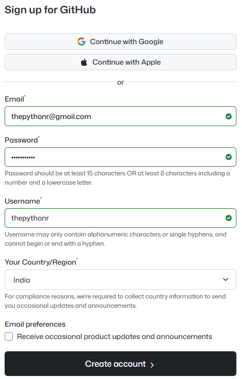
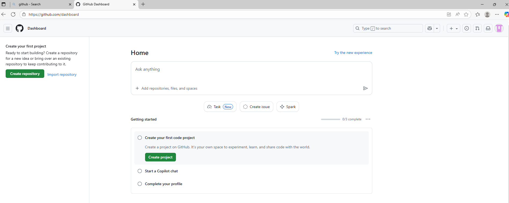
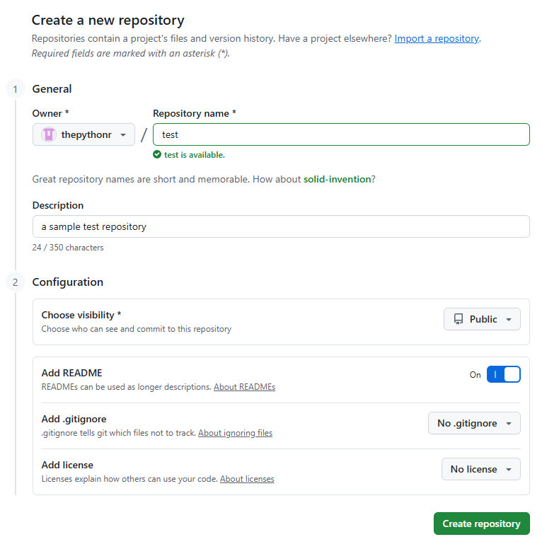
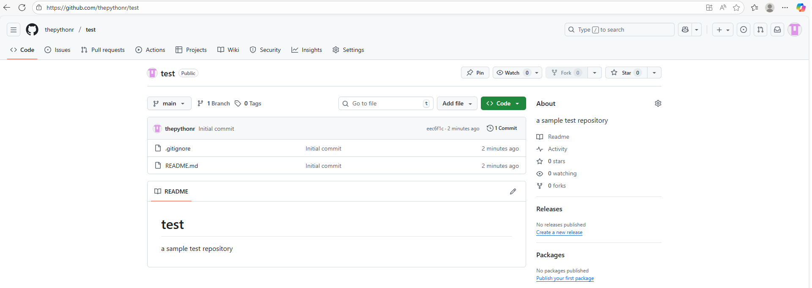
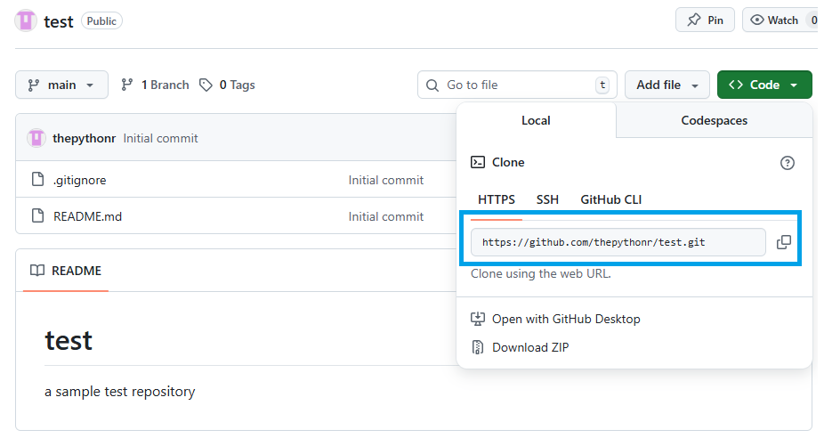

# Configure Git Server account and repository (using GitHub)

Below are the steps:
1. go to https://github.com/

2. Signup as given below
<p style="text-align: center;">
 
</p>
3. Finish the verifications.

It will redirect to below dashboard https://github.com/dashboard:

<div style="text-align: center;">
 
</div>

4. In Top-left corner there have 2 options:
    - **Create Repository:** Allows you to create new repository.
    - **Import Repository:** Allows you to import other github repository and create new one using imported repository.

5. Choose create Repository
    - Add a test repository for understanding the flow

    <div style="text-align: center;">
        
    </div>

6. Click on **Create Repository** button and it will create repository in remote server of github. You can interact using the webpages as given below:

<div style="text-align: center;">
 
</div>

**Now you have to connect with this remote server repository using a Git client**


# Configure Git Client and Connect to Your Repository

### Step 1: Install Git Client

Download and install Git from [git-scm.com/install/](https://git-scm.com/install/).

**Prefer a graphical interface?** Check out [Git GUI tools](https://git-scm.com/tools/guis) for alternatives.

### Step 2: Open a Terminal

**On Linux:** Use your system bash directly to run Git commands.

**On Windows:** Use **Git Bash**, which is installed automatically with git-scm.

### Step 3: Navigate to Your Desired Directory

Move to the directory where you want to clone the repository:

```bash
cd /path/to/your/directory
```

### Step 4: Clone the Repository

Clone your remote repository using the `git clone` command:

```bash
git clone REPOSITORY_URL
```

**Where do I find `REPOSITORY_URL`?** Copy it from your remote repository page:

<div style="text-align: center;">
 
</div>

### Step 5: Explore Your Repository Structure

Navigate to the newly created folder and view its structure:

```bash
cd repository-name
```

You should see the `.git/` directory and other project files. To view hidden files (including `.git/`), enable the "show hidden files" option in your file explorer.

> [!NOTE]
> **You have successfully completed the following:**
> 
> 1. Created a remote repository on GitHub
> 2. Cloned the remote repository to your local machine, creating a local copy
> 3. Established a connection between your local and remote repositories for future synchronization

### How to see your git Client-Server connection config ?
Open your `./.git/config` file

You can see the configuration as given below:
```
[core]
	repositoryformatversion = 0
	filemode = false
	bare = false
	logallrefupdates = true
	symlinks = false
	ignorecase = true
[remote "origin"]
	url = https://github.com/USER_NAME/REPO_NAME.git
	fetch = +refs/heads/*:refs/remotes/origin/*
[branch "main"]
	remote = origin
	merge = refs/heads/main
```

Note the `[remote "origin"]` section.
