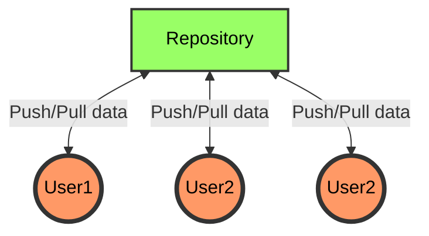
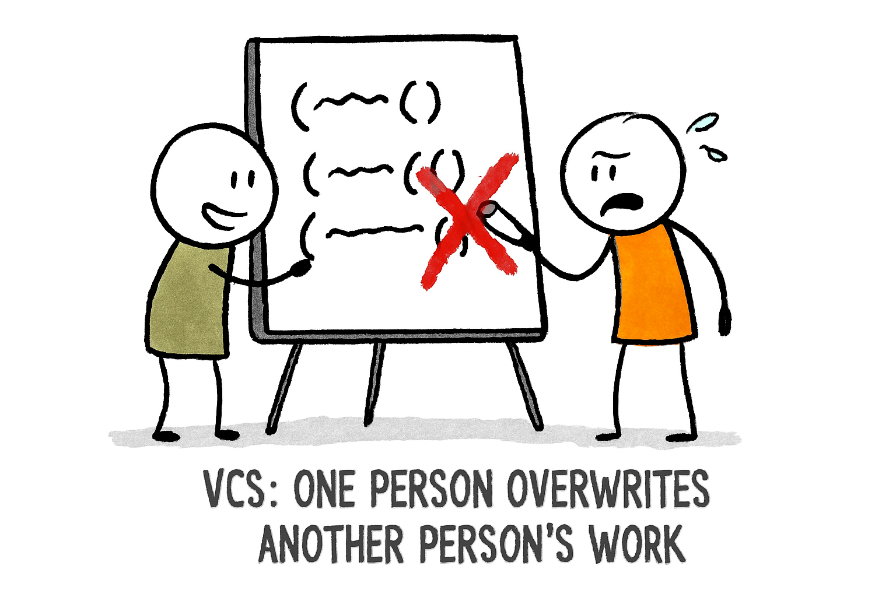
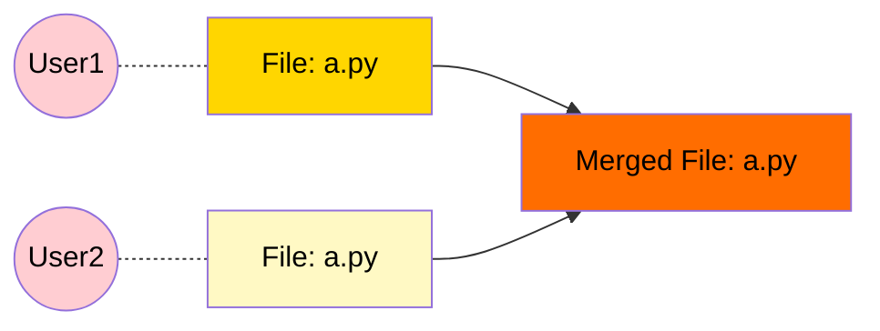
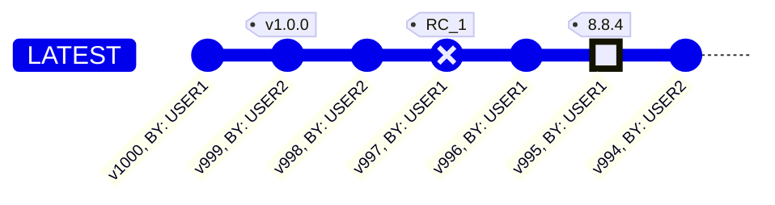
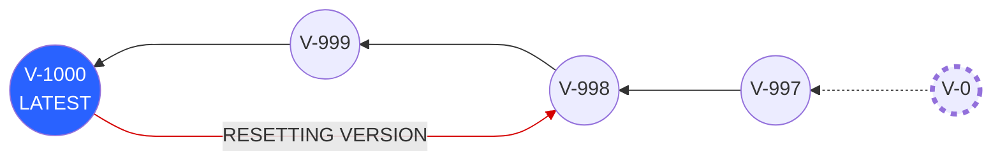
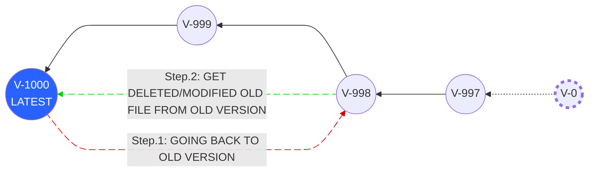
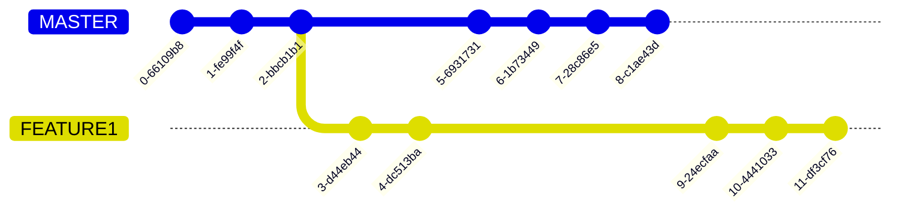

# ❓What is Git?

Git is a version control system.

## 🛠️ What is a Version Control System?

A **Version Control System (VCS)** is a software tool that helps developers manage changes to their project over time.

## 🔧 Why a Version Control System is Required?

When working on a project—especially as a team—files are constantly being added, modified, or deleted. Without a system to manage these changes, things can quickly become messy and confusing.

A Version Control System (VCS) helps solve common problems like:

### 1. Need of a shared place (like a server) where all your/teams project files and changes are saved.

### 2. Multiple people working on the same project without overwriting each other's work

    

### 3. Merging changes from different team members safely and efficiently

### 4. Tracking who changed what, when, and why—keeping a full history (or versions) of edits

### 5.  Going back to any of the previous versions of the project

### 6.  Recovering deleted files or reverting to earlier versions when needed

### 7. Creating and working with isolated branches without affecting each other

## 🧭 Centralized vs Distributed VCS

A **Centralized VCS** stores all project history in a single central server. Developers connect to this server to get the latest version and to save their changes.

A **Distributed VCS** (like Git) gives every developer a full copy of the entire repository—including its history. This means each user's machine acts like a mini-server, allowing work even without internet access.

Earlier, only centralized systems were common. But today, distributed systems are more popular because they offer better speed, flexibility, and offline access.

> _In short: centralized VCS relies on one hub, while distributed VCS gives everyone a complete copy._

See details [Here](./compare.md)