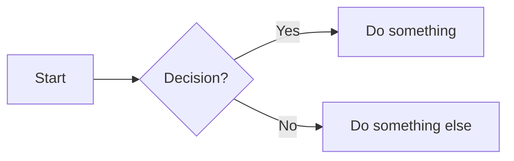

# 🧭 Mermaid Tutorial

Mermaid is a **text-to-diagram tool** that lets you create diagrams.
It’s widely used in **documentation, wikis, and technical writing** with tools like VS Code, GitHub, Notion, etc.

## ✨ Why Use Mermaid?

1. **Plain text diagrams** – You don’t need drag-and-drop editors.  
2. **Lightweight** – Because it is text, the diagram size is very small.  
3. **Readable** – The text itself looks like a diagram, unlike complex SVG code.  
4. **Supported** – Many tools in the market already support Mermaid.  

## 🛠️ How Mermaid source looks
Below is an example of Mermaid source code.

~~~text

~~~

And its corresponding diagram looks like:

## 📊 Common Diagram Types

1. [Flowchart](./docs/flowchart.md)
2. [Sequence Diagram](./docs/sequence-diagram.md)
3. [Class Diagram](./docs/class-diagram.md)
4. [State Diagram](./docs/state-diagram.md)
5. [Gantt Chart](./docs/gantt.md)
6. [Git Graph](./docs/git-graph.md)

