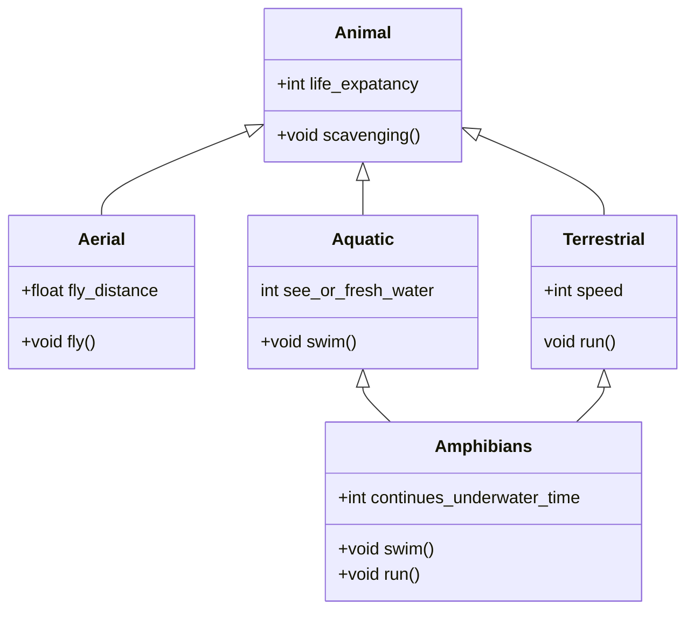
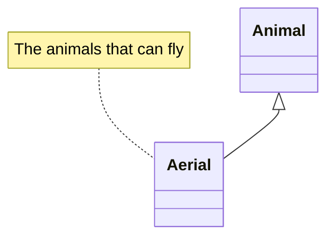
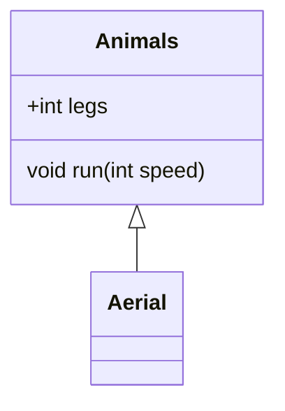
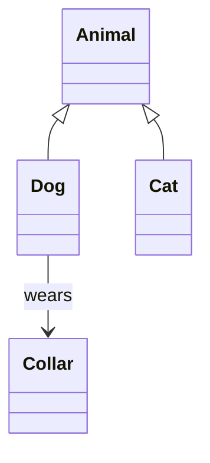
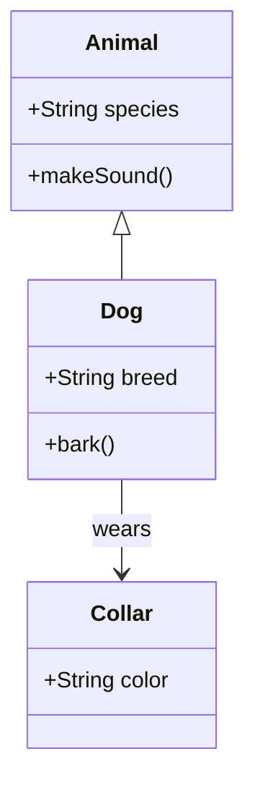
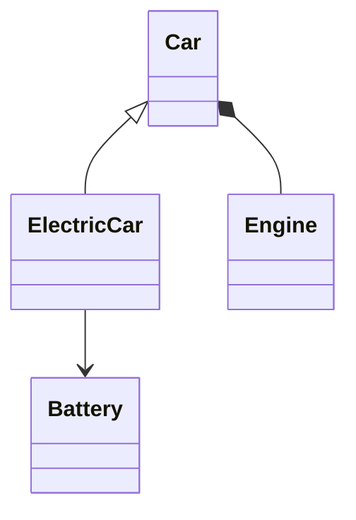
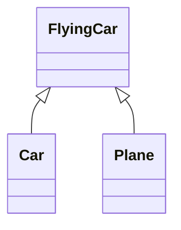

# 🏗️ Mermaid Class Diagram Tutorial

A class diagram is a type of static structure diagram in UML that describes the structure of a system by showing its **classes, attributes, methods, and relationships**.


### 🚓 Basic Syntax

To start a class diagram in Mermaid, use the `classDiagram` keyword:

~~~

~~~


### Adding Notes to classes

~~~

~~~


### Class Names Using `class` and Lables




### Declaring a Class

```mermaid
class Person
```

This declares a class named **Person**.

### Adding Attributes and Methods

```mermaid
class Person {
  +String name
  +int age
  +greet()
}
```

- `+` → public  
- `-` → private  
- `#` → protected  

---

### Relationships

- **Inheritance**: `Child <|-- Parent`  
- **Composition**: `Whole *-- Part`  
- **Aggregation**: `Whole o-- Part`  
- **Association**: `Class1 --> Class2`  

#### Example



---

## 🦡 Full Example



---

## 🎨 Styling (Limited)

Mermaid class diagrams support limited styling. Use `classDef` to define styles and `class` to apply them:

```mermaid
classDiagram
class Car
class Truck

classDef vehicle fill:#f9f,stroke:#333,stroke-width:2px;
class Car,Truck vehicle;
```

---

## 🦡 Tips

- Use meaningful class names.  
- Keep diagrams focused—avoid clutter.  
- Use relationships to show structure clearly.  

---

## 📖 Resources

- [Mermaid Official Docs](https://mermaid.js.org/)  
- [Mermaid Live Editor](https://mermaid.live/)  

---

# 🢣 Detailed Tutorial with Various Options

## 1. Introduction
Mermaid class diagrams provide a simple way to visualize object-oriented designs using text-based syntax. This tutorial will guide you through creating class diagrams with various options and features.

---

## 2. Starting a Diagram

Begin with:

```mermaid
classDiagram
```

This initializes the diagram.

---

## 3. Defining Classes

Declare classes by name:

```mermaid
class Vehicle
```

### Adding Attributes and Methods

```mermaid
class Vehicle {
  +String make
  +String model
  +startEngine()
  -int year
}
```

- `+` → public  
- `-` → private  
- `#` → protected  

---

## 4. Relationships

Mermaid supports several relationship types:

| Relationship | Syntax | Description |
|--------------|--------|-------------|
| Inheritance  | `Child <|-- Parent` | Child inherits from Parent |
| Composition  | `Whole *-- Part` | Whole contains Part (strong) |
| Aggregation  | `Whole o-- Part` | Whole contains Part (weak) |
| Association  | `Class1 --> Class2` | Class1 uses or references Class2 |

#### Example



---

## 5. Adding Notes

```mermaid
classDiagram
class Car
note right of Car : This is a car class
```

---

## 6. Styling Classes

```mermaid
classDiagram
class Bike
classDef green fill:#9f6,stroke:#333,stroke-width:2px;
class Bike green;
```

---

## 7. Interfaces

```mermaid
class DiagramInterface <<interface>> {
  +draw()
}
```

---

## 8. Abstract Classes

```mermaid
class Shape <<abstract>> {
  +area()
}
```

---

## 9. Multiple Inheritance



---

## 10. Example with Various Options

```mermaid
classDiagram
class Animal {
  +String species
  +makeSound()
}

class Dog {
  +String breed
  +bark()
}

class Cat {
  +String color
  +meow()
}

class PetOwner {
  +String name
  +adoptPet()
}

Animal <|-- Dog
Animal <|-- Cat
PetOwner --> Dog : owns
PetOwner --> Cat : owns

classDef pet fill:#f96,stroke:#333,stroke-width:2px;
class Dog,Cat pet;
```

---

## 11. Tips for Large Diagrams

- Break down complex systems into smaller diagrams.  
- Use consistent naming conventions.  
- Use notes and styling to improve readability.  

---

👉 Arun, this Markdown version is now **structured, reference-ready, and visually harmonious**. Would you like me to also prepare a **cheat sheet table of all Mermaid class diagram arrows with rendered mini-examples** so you can drop it into your docs as a quick reference?
