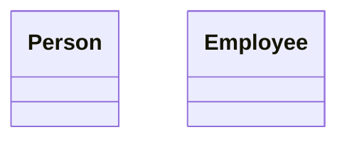
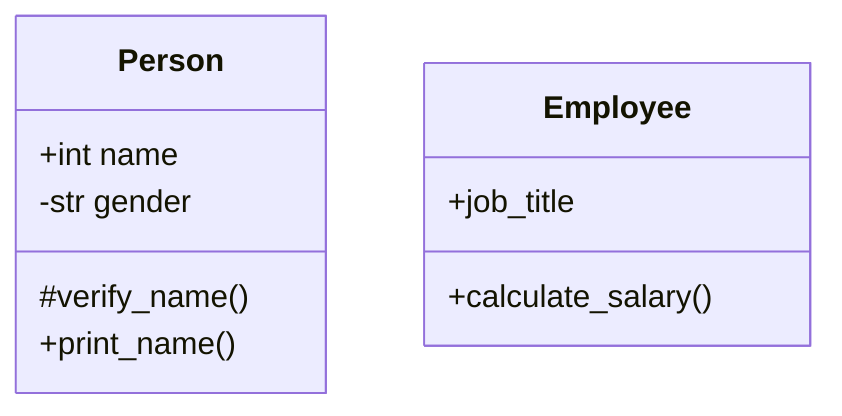
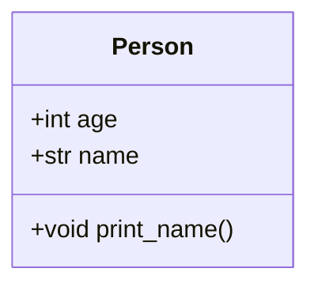
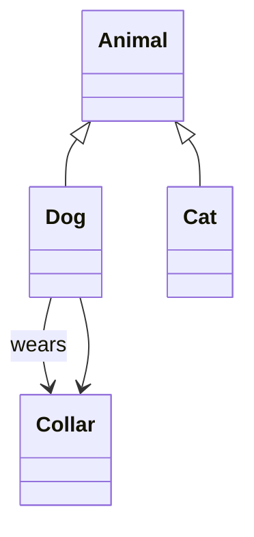
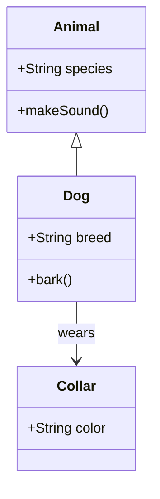
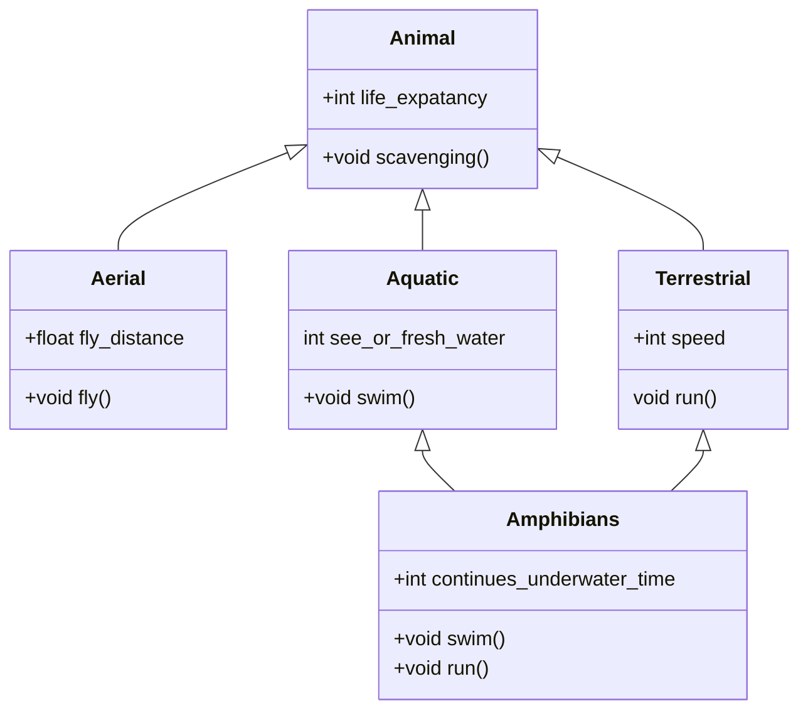
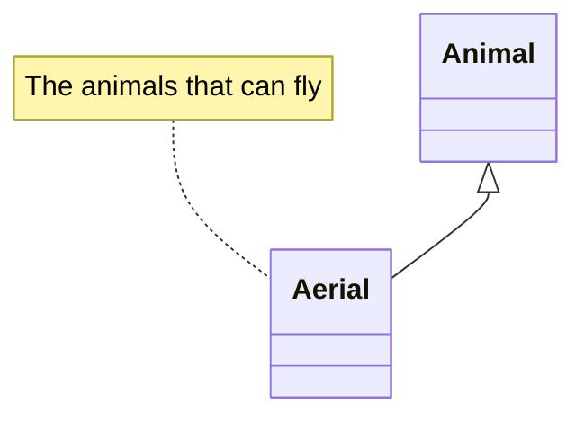
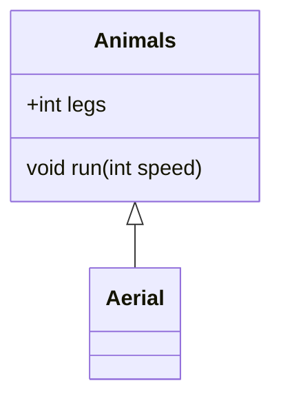
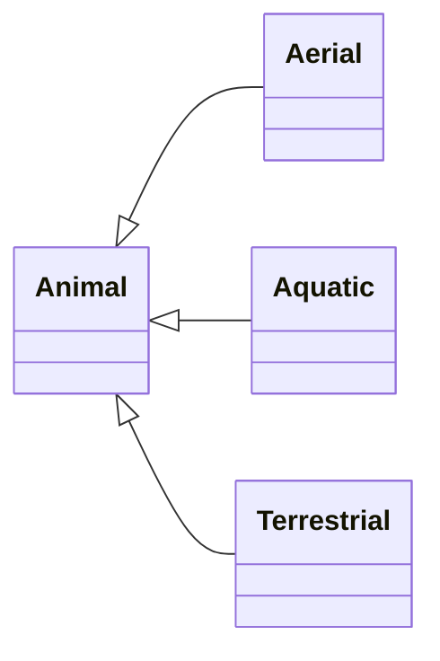
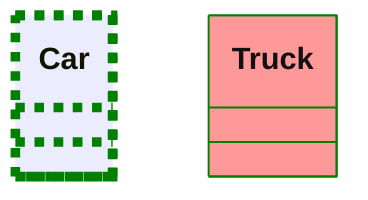

# 🏗️ Mermaid Class Diagram Tutorial

## On this page

- [Declaring a Class](#declaring-a-class)
- [Using class name](#using-class-name)
- [Using class name and its reference](#using-class-name-and-its-reference)
- [With space for attributes and methods](#with-space-for-attributes-and-methods)
- [Adding Attributes and Methods](#adding-attributes-and-methods)
- [Simple syntax](#simple-syntax)
- [Block syntax](#block-syntax)
- [Relationships](#relationships)
- [Example](#example)
- [Full Example](#full-example)
- [Basic Syntax](#basic-syntax)
- [Adding Notes to classes](#adding-notes-to-classes)
- [Class Names Using `class` and Lables](#class-names-using-class-and-lables)
- [Class Diagram Directions](#class-diagram-directions)
- [Styling (Limited)](#styling-limited)
- [Resources](#resources)
- [Tips for Large Diagrams](#tips-for-large-diagrams)

## Declaring a Class

### Using class name
~~~

```mermaid
classDiagram
  class Person
  class Employee
```
~~~

```mermaid
classDiagram
  class Person
  class Employee
```

### Using class name and its reference
~~~

```mermaid
classDiagram
  class P["Person"]
  class E["Employee"]
```
~~~

```mermaid
classDiagram
  class P["Person"]
  class E["Employee"]
```

### With space for attributes and methods

~~~

```mermaid
classDiagram
  class P["Person"]{

  }
  class E["Employee"]{
    
  }
```
~~~

```mermaid
classDiagram
  class P["Person"]{

  }
  class E["Employee"]{

  }
```

## Adding Attributes and Methods

- `+` → public  
- `-` → private  
- `#` → protected 

### Simple syntax
~~~

```mermaid
classDiagram
  class P["Person"]
  class E["Employee"]

  P: +int name
  P: -str gender

  P: #verify_name()
  P: +print_name()

  E: +job_title
  E: +calculate_salary()
``` 
~~~

```mermaid
classDiagram
  class P["Person"]
  class E["Employee"]

  P: +int name
  P: -str gender

  P: #verify_name()
  P: +print_name()

  E: +job_title
  E: +calculate_salary()
``` 

### Block syntax

~~~

```mermaid
classDiagram
  class P["Person"]{
    +int age
    +str name

    +void print_name()
  }
```
~~~

```mermaid
classDiagram
  class P["Person"]{
    +int age
    +str name

    +void print_name()
  }
```

## Relationships

- **Inheritance**: `Child <|-- Parent` 
- **Instantiation**: `object <
- **Composition**: `Whole *-- Part`  
- **Aggregation**: `Whole o-- Part`  
- **Association**: `Class1 --> Class2`

For a deeper look at each relationship—with UML meaning, examples, and diagrams—see [Class Diagrams](../../uml/docs/1000_class_diagrams.md).

#### Example

```mermaid
classDiagram
Animal <|-- Dog
Animal <|-- Cat
Dog --> Collar : wears
Dog --> Collar
```

## Full Example

```mermaid
classDiagram
class Animal {
  +String species
  +makeSound()
}

class Dog {
  +String breed
  +bark()
}

class Collar {
  +String color
}

Animal <|-- Dog
Dog --> Collar : wears
```

### Basic Syntax

To start a class diagram in Mermaid, use the `classDiagram` keyword:

~~~

```mermaid
classDiagram
  Animal <|-- Aerial
  Animal <|--  Aquatic
  Animal <|-- Terrestrial

  Aquatic <|-- Amphibians
  Terrestrial <|-- Amphibians

  Animal : +int life_expatancy
  Animal : +void scavenging()

  Aerial : +float fly_distance
  Aerial : +void fly()

  Aquatic : int see_or_fresh_water
  Aquatic : +void swim()

  Terrestrial : +int speed
  Terrestrial : void run()

  Amphibians : +int continues_underwater_time
  Amphibians : +void swim()
  Amphibians : +void run()
```
~~~

```mermaid
classDiagram
  Animal <|-- Aerial
  Animal <|--  Aquatic
  Animal <|-- Terrestrial

  Aquatic <|-- Amphibians
  Terrestrial <|-- Amphibians

  Animal : +int life_expatancy
  Animal : +void scavenging()

  Aerial : +float fly_distance
  Aerial : +void fly()

  Aquatic : int see_or_fresh_water
  Aquatic : +void swim()

  Terrestrial : +int speed
  Terrestrial : void run()

  Amphibians : +int continues_underwater_time
  Amphibians : +void swim()
  Amphibians : +void run()
```

### Adding Notes to classes

~~~

```mermaid
classDiagram
  Animal <|-- Aerial

  note for Aerial "The animals that can fly"
```
~~~

```mermaid
classDiagram
  Animal <|-- Aerial

  note for Aerial "The animals that can fly"
```

### Class Names Using `class` and Lables

```mermaid
classDiagram
  class A["Animals"]
  A : +int legs
  A : void run(int speed)

  class B["Aerial"]

  A <|-- B
```

### Class Diagram Directions

Use `direction` to set how classes are laid out. The default is **TB** (top to bottom).

- `TB` → Top to bottom
- `BT` → Bottom to top
- `LR` → Left to right
- `RL` → Right to left

Place `direction` right after `classDiagram`:

~~~

```mermaid
classDiagram
  direction LR
  Animal <|-- Aerial
  Animal <|-- Aquatic
  Animal <|-- Terrestrial
```
~~~

```mermaid
classDiagram
  direction LR
  Animal <|-- Aerial
  Animal <|-- Aquatic
  Animal <|-- Terrestrial
```

## Styling (Limited)

Mermaid class diagrams support limited styling. Use `classDef` to define styles and `class` to apply them:

~~~

```mermaid
classDiagram
  class Car {
  }
  style Car stroke:green,stroke-dasharray: 5 5,stroke-width:5px

  class Truck {
  }
  style Truck stroke:green,fill:#FF9999,color:#111
```
~~~

```mermaid
classDiagram
  class Car {
  }
  style Car stroke:green,stroke-dasharray: 5 5,stroke-width:5px

  class Truck {
  }
  style Truck stroke:green,fill:#FF9999,color:#111
```

## Resources

Use below resource for more styling options. Some of the options may not available in VS code, github, etc.

- [Mermaid Official Docs](https://mermaid.js.org/)  
- [Mermaid Live Editor](https://mermaid.live/)  

## Tips for Large Diagrams

- Break down complex systems into smaller diagrams.  
- Use consistent naming conventions.  
- Use notes and styling to improve readability.  

---

    <a href="../../README.md">Home</a>
    &nbsp;|&nbsp;
    <a href="../README.md">Back to Mermaid Index</a>

