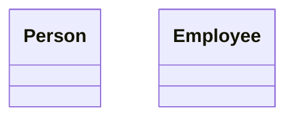
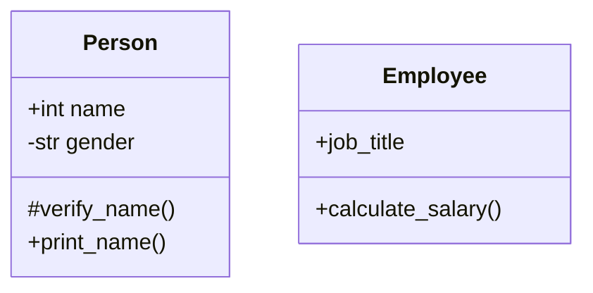
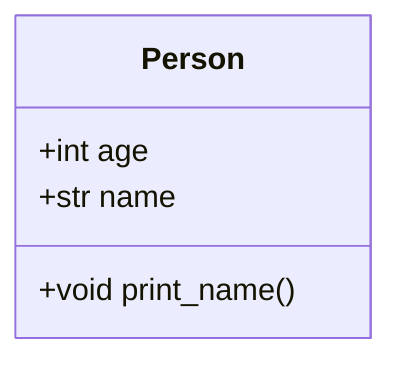
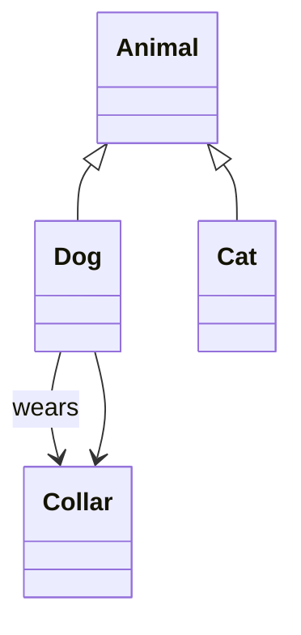
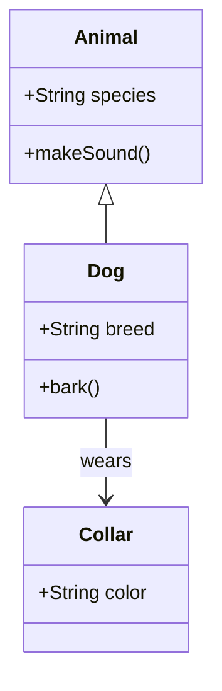
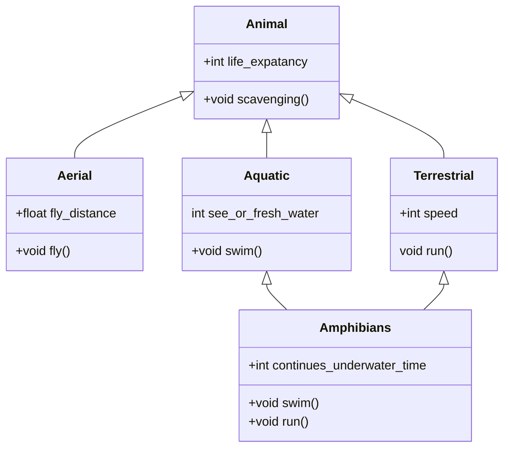
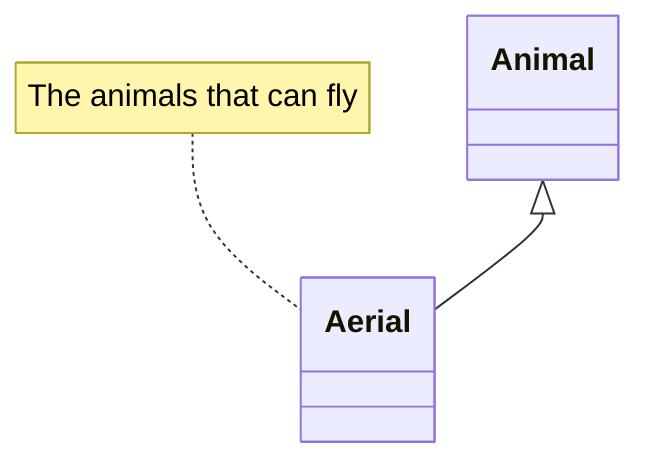
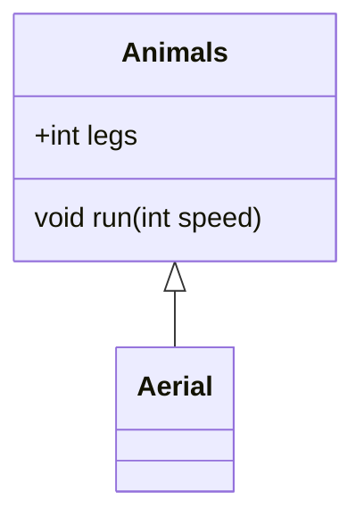

# 🏗️ Mermaid Class Diagram Tutorial

## On this page

- [Declaring a Class](#declaring-a-class)
- [Adding Attributes and Methods](#adding-attributes-and-methods)
- [Relationships](#relationships)
- [🦡 Full Example](#full-example)
- [🎨 Styling (Limited)](#styling-limited)
- [🦡 Tips](#tips)
- [📖 Resources](#resources)
- [🢣 Detailed Tutorial with Various Options](#detailed-tutorial-with-various-options)
- [1. Introduction](#1-introduction)
- [2. Starting a Diagram](#2-starting-a-diagram)
- [3. Defining Classes](#3-defining-classes)
- [4. Relationships](#4-relationships)
- [5. Adding Notes](#5-adding-notes)
- [6. Styling Classes](#6-styling-classes)
- [7. Interfaces](#7-interfaces)
- [8. Abstract Classes](#8-abstract-classes)
- [9. Multiple Inheritance](#9-multiple-inheritance)
- [10. Example with Various Options](#10-example-with-various-options)
- [11. Tips for Large Diagrams](#11-tips-for-large-diagrams)

A class diagram is a type of static structure diagram in UML that describes the structure of a system by showing its **classes, attributes, methods, and relationships**.

## Declaring a Class

### Method1: Using class name
~~~

```mermaid
classDiagram
  class Person
  class Employee
```
~~~

```mermaid
classDiagram
  class Person
  class Employee
```

### Method2: Using class name and its reference
~~~

```mermaid
classDiagram
  class P["Person"]
  class E["Employee"]
```
~~~

```mermaid
classDiagram
  class P["Person"]
  class E["Employee"]
```

### With Space to provide attributes and methods

~~~

```mermaid
classDiagram
  class P["Person"]{

  }
  class E["Employee"]{
    
  }
```
~~~

```mermaid
classDiagram
  class P["Person"]{

  }
  class E["Employee"]{

  }
```

## Adding Attributes and Methods

- `+` → public  
- `-` → private  
- `#` → protected 

### Method1: Simple
~~~

```mermaid
classDiagram
  class P["Person"]
  class E["Employee"]

  P: +int name
  P: -str gender

  P: #verify_name()
  P: +print_name()

  E: +job_title
  E: +calculate_salary()
``` 
~~~

```mermaid
classDiagram
  class P["Person"]
  class E["Employee"]

  P: +int name
  P: -str gender

  P: #verify_name()
  P: +print_name()

  E: +job_title
  E: +calculate_salary()
``` 

### Method2: More readable

~~~

```mermaid
classDiagram
  class P["Person"]{
    +int age
    +str name

    +void print_name()
  }
```
~~~

```mermaid
classDiagram
  class P["Person"]{
    +int age
    +str name

    +void print_name()
  }
```

## Relationships

- **Inheritance**: `Child <|-- Parent` 
- **Instantiation**: `object <
- **Composition**: `Whole *-- Part`  
- **Aggregation**: `Whole o-- Part`  
- **Association**: `Class1 --> Class2`  

#### Example

```mermaid
classDiagram
Animal <|-- Dog
Animal <|-- Cat
Dog --> Collar : wears
Dog --> Collar
```

---

## 🦡 Full Example

```mermaid
classDiagram
class Animal {
  +String species
  +makeSound()
}

class Dog {
  +String breed
  +bark()
}

class Collar {
  +String color
}

Animal <|-- Dog
Dog --> Collar : wears
```

### 🚓 Basic Syntax

To start a class diagram in Mermaid, use the `classDiagram` keyword:

~~~

```mermaid
classDiagram
  Animal <|-- Aerial
  Animal <|--  Aquatic
  Animal <|-- Terrestrial

  Aquatic <|-- Amphibians
  Terrestrial <|-- Amphibians

  Animal : +int life_expatancy
  Animal : +void scavenging()

  Aerial : +float fly_distance
  Aerial : +void fly()

  Aquatic : int see_or_fresh_water
  Aquatic : +void swim()

  Terrestrial : +int speed
  Terrestrial : void run()

  Amphibians : +int continues_underwater_time
  Amphibians : +void swim()
  Amphibians : +void run()
```
~~~

```mermaid
classDiagram
  Animal <|-- Aerial
  Animal <|--  Aquatic
  Animal <|-- Terrestrial

  Aquatic <|-- Amphibians
  Terrestrial <|-- Amphibians

  Animal : +int life_expatancy
  Animal : +void scavenging()

  Aerial : +float fly_distance
  Aerial : +void fly()

  Aquatic : int see_or_fresh_water
  Aquatic : +void swim()

  Terrestrial : +int speed
  Terrestrial : void run()

  Amphibians : +int continues_underwater_time
  Amphibians : +void swim()
  Amphibians : +void run()
```

### Adding Notes to classes

~~~

```mermaid
classDiagram
  Animal <|-- Aerial

  note for Aerial "The animals that can fly"
```
~~~

```mermaid
classDiagram
  Animal <|-- Aerial

  note for Aerial "The animals that can fly"
```

### Class Names Using `class` and Lables

```mermaid
classDiagram
  class A["Animals"]
  A : +int legs
  A : void run(int speed)

  class B["Aerial"]

  A <|-- B
```

---

## 🎨 Styling (Limited)

Mermaid class diagrams support limited styling. Use `classDef` to define styles and `class` to apply them:

```mermaid
classDiagram
class Car{

}

class Truck{

}

classDef vehicle fill:#f9f,stroke:#333,stroke-width:2px;


class Car Vehicle;
```

---

## 🦡 Tips

- Use meaningful class names.  
- Keep diagrams focused—avoid clutter.  
- Use relationships to show structure clearly.  

---

## 📖 Resources

- [Mermaid Official Docs](https://mermaid.js.org/)  
- [Mermaid Live Editor](https://mermaid.live/)  

---

# 🢣 Detailed Tutorial with Various Options

## 1. Introduction
Mermaid class diagrams provide a simple way to visualize object-oriented designs using text-based syntax. This tutorial will guide you through creating class diagrams with various options and features.

---

## 2. Starting a Diagram

Begin with:

```mermaid
classDiagram
```

This initializes the diagram.

---

## 3. Defining Classes

Declare classes by name:

```mermaid
class Vehicle
```

### Adding Attributes and Methods

```mermaid
class Vehicle {
  +String make
  +String model
  +startEngine()
  -int year
}
```

- `+` → public  
- `-` → private  
- `#` → protected  

---

## 4. Relationships

Mermaid supports several relationship types:

| Relationship | Syntax | Description |
|--------------|--------|-------------|
| Inheritance  | `Child <|-- Parent` | Child inherits from Parent |
| Composition  | `Whole *-- Part` | Whole contains Part (strong) |
| Aggregation  | `Whole o-- Part` | Whole contains Part (weak) |
| Association  | `Class1 --> Class2` | Class1 uses or references Class2 |

#### Example

```mermaid
classDiagram
Car <|-- ElectricCar
Car *-- Engine
ElectricCar --> Battery
```

---

## 5. Adding Notes

```mermaid
classDiagram
class Car
note right of Car : This is a car class
```

---

## 6. Styling Classes

```mermaid
classDiagram
class Bike
classDef green fill:#9f6,stroke:#333,stroke-width:2px;
class Bike green;
```

---

## 7. Interfaces

```mermaid
class DiagramInterface <<interface>> {
  +draw()
}
```

---

## 8. Abstract Classes

```mermaid
class Shape <<abstract>> {
  +area()
}
```

---

## 9. Multiple Inheritance

```mermaid
classDiagram
FlyingCar <|-- Car
FlyingCar <|-- Plane
```

---

## 10. Example with Various Options

```mermaid
classDiagram
class Animal {
  +String species
  +makeSound()
}

class Dog {
  +String breed
  +bark()
}

class Cat {
  +String color
  +meow()
}

class PetOwner {
  +String name
  +adoptPet()
}

Animal <|-- Dog
Animal <|-- Cat
PetOwner --> Dog : owns
PetOwner --> Cat : owns

classDef pet fill:#f96,stroke:#333,stroke-width:2px;
class Dog,Cat pet;
```

---

## 11. Tips for Large Diagrams

- Break down complex systems into smaller diagrams.  
- Use consistent naming conventions.  
- Use notes and styling to improve readability.  

---

👉 Arun, this Markdown version is now **structured, reference-ready, and visually harmonious**. Would you like me to also prepare a **cheat sheet table of all Mermaid class diagram arrows with rendered mini-examples** so you can drop it into your docs as a quick reference?

    <a href="../README.md">Back to Mermaid Index</a>

