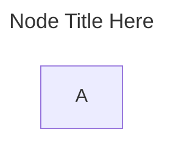
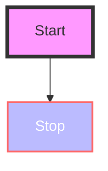
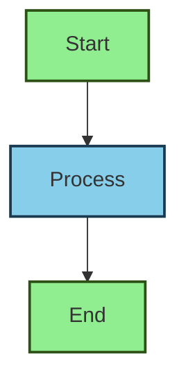
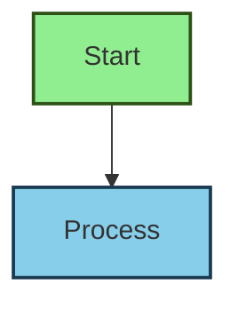
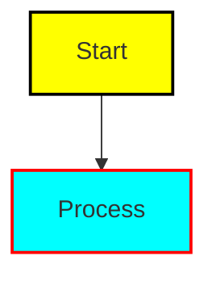
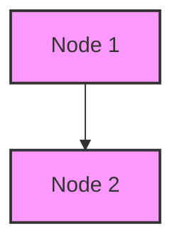
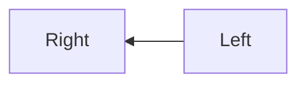
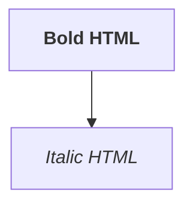
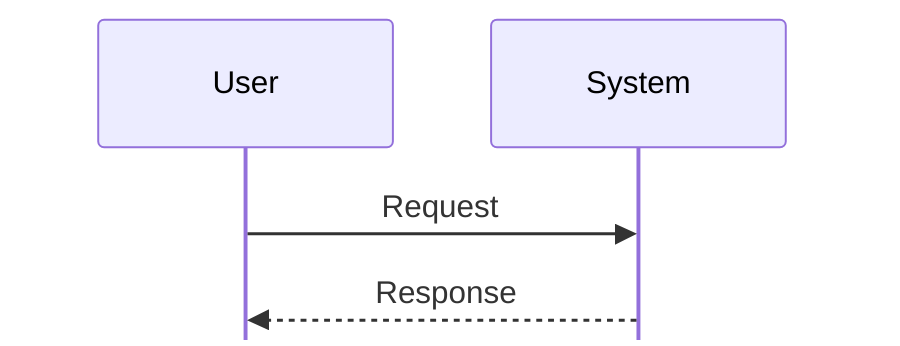

# ⚙️ Mermaid Configuration Tutorial

Mermaid diagrams are highly customizable. This tutorial explores the different configurations methods available.

## 📝 Adding Comments in Mermaid Diagrams

Mermaid does not provide its own dedicated comment syntax.  
Because Mermaid is usually embedded inside another language (such as Markdown), you can rely on the **host language’s comment style** instead.  

Since this page is written in **Markdown**, we can simply use Markdown comments here.

 
 ~~~

~~~


## 🏷️ Title of Mermaid Diagram

~~~

~~~


<br/>

# 🛠️ Mermaid Configurations

## 🌐 1. Global Configuration

Mermaid allows you to set **global defaults** that apply to all diagrams.

~~~
```mermaid
%%{init: {'theme':'forest', 'logLevel':'debug'}}%%
flowchart LR
    A[Start] --> B[Configured Node]
~~~

```mermaid
%%{init: {'theme':'forest', 'logLevel':'debug'}}%%
flowchart LR
    A[Start] --> B[Configured Node]
```

<br/>

- `%%{init: {...}}%%` → is the configuration directive at the top of the diagram.

<br/>


## 🎨 2. Themes & Styling

Mermaid comes with built-in themes, but you can override styles.

### Built-in Themes
- `default`
- `forest`
- `dark`
- `neutral`
- `base`

This is explained above.

~~~
```mermaid
%%{init: {'theme':'dark'}}%%
flowchart LR
    A --> B
~~~

```mermaid
%%{init: {'theme':'dark'}}%%
flowchart LR
    A --> B
```

### Using CSS: Apply CSS styles using IDs

~~~

~~~


<br/>

### Define reusable style classes using `classDef` and apply using `:::`

~~~

~~~


<br/>

### Apply a calss to an ID

```



<br/>

### Default Class

~~~

~~~


<br/>

## 🔄 3. Layout Configuration

### Control diagram direction and spacing.

~~~

~~~


- Available Directions:
  - `TB` → Top to Bottom
  - `BT` → Bottom to Top
  - `LR` → Left to Right
  - `RL` → Right to Left

<br/><br/>

## 🔒 4. Security Configuration

Mermaid supports different **security levels** using below tag in `%%{init: {...}}%%`

`securityLevel`: `"strict"`, `"loose"`, `"antiscript"`

The **securityLevel** setting controls whether HTML tags are supported.  
For example: `<b>` for bold text.  

Allowing HTML tags can introduce the risk of **HTML injection vulnerabilities**, so this option should be used with caution.

> [!TIP] some renderer like VScode does not support it.

~~~

~~~


## 🧩 5. Diagram-Specific Configurations

Each diagram type has its own configuration options.

### Sequence Diagram
~~~

~~~


- `mirrorActors`: duplicates actors on both sides.
- `rightAngles`: forces right-angle connectors.

<br/>

### Gantt Chart
~~~
```mermaid
%%{init: {'gantt': {'titleTopMargin':25, 'barHeight':30}}}%%
gantt
    title Project Timeline
    dateFormat  YYYY-MM-DD
    section Development
    Task A :a1, 2025-11-01, 5d
    Task B :after a1, 3d
```
~~~

```mermaid
%%{
    init: {
        'gantt': {'titleTopMargin':25, 'barHeight':30},
        'themeVariables': { 'taskColor': '#ffcc00', 'taskTextColor': '#000000'}
    }
}%%
gantt
    title Project Timeline
    dateFormat  YYYY-MM-DD
    section Development
    Task A :a1, 2025-11-01, 5d
    Task B :after a1, 3d
```

<br/>

### Flowchart

`nodeSpacing` and `rankSpacing` in `init`.

~~~
```mermaid
%%{init: {'flowchart': {'nodeSpacing': 50, 'rankSpacing': 80}}}%%
flowchart LR
    A --> B --> C
~~~

```mermaid
%%{init: {'flowchart': {'nodeSpacing': 50, 'rankSpacing': 80}}}%%
flowchart LR
    A --> B --> C
```

<br/><br/>

## 🚀 7. Advanced Configuration with JSON

You can pass many configurations as a JSON object to `init` as given below:


~~~
```mermaid
---
HEADING
---
%%{init: {
  'theme': 'forest',
  'themeVariables': { 'primaryColor': '#ffcc00', 'fontSize': '35px' },
  'flowchart': { 'curve': 'basis', 'nodeSpacing': 50, 'rankSpacing': 80 },
  'sequence': { 'mirrorActors': true, 'showSequenceNumbers': true },
  'gantt': { 'titleTopMargin': 25, 'barHeight': 30 },
  'class': { 'useMaxWidth': true },
  'state': { 'padding': 15, 'nodeSpacing': 40 }
}}%%
flowchart LR
    A --> B
```
~~~


```mermaid
---
HEADING
---
%%{init: {
  'theme': 'forest',
  'themeVariables': { 'primaryColor': '#ffcc00', 'fontSize': '35px' },
  'flowchart': { 'curve': 'basis', 'nodeSpacing': 50, 'rankSpacing': 80 },
  'sequence': { 'mirrorActors': true, 'showSequenceNumbers': true },
  'gantt': { 'titleTopMargin': 25, 'barHeight': 30 },
  'class': { 'useMaxWidth': true },
  'state': { 'padding': 15, 'nodeSpacing': 40 }
}}%%
flowchart LR
    A --> B
```