# 🔀 Flowchart Diagrams

A **flowchart** is a visual representation of a process or workflow using connected shapes and arrows. It shows the step-by-step flow of logic, decisions, and actions.

A simplest flowchart can be represented in **mermaid** using:
~~~
```mermaid
flowchart
flowchart
    NODE_ID1[NODE 1] --LINK TEXT--> NODE_ID2[NODE 2]
```
~~~

And its visual diagram looks like:
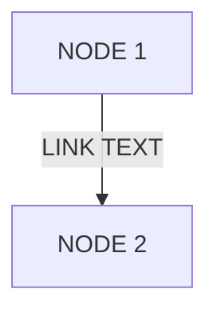

It contains:
1. Node
2. Link
3. Link text

## 📐 Node Shapes Supported by `flowchart`

Mermaid supports many different node shapes. Some common examples are shown below:

### Example: Multiple Shapes

~~~

~~~
And the output is given below:
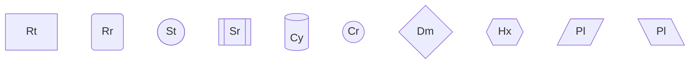

## 🧭 Flowchart Links

Nodes are connected using links.

### 1. Link labels:

Links can include descriptive text labels:

~~~
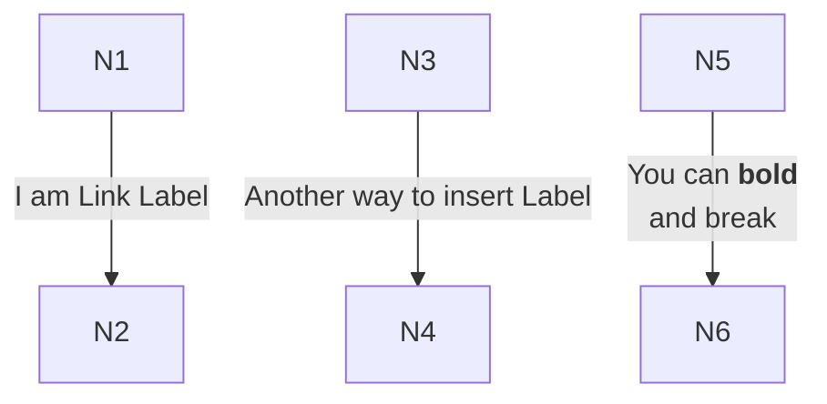
~~~

And the corresponding diagram looks like:


### 2. Link Arrows

~~~
```mermaid
flowchart
    N1[N1] --1-- N2[N2]
    N3[N3] --2--> N4[N4]
    N5[N5] <--3--> N6[N6]
```
~~~

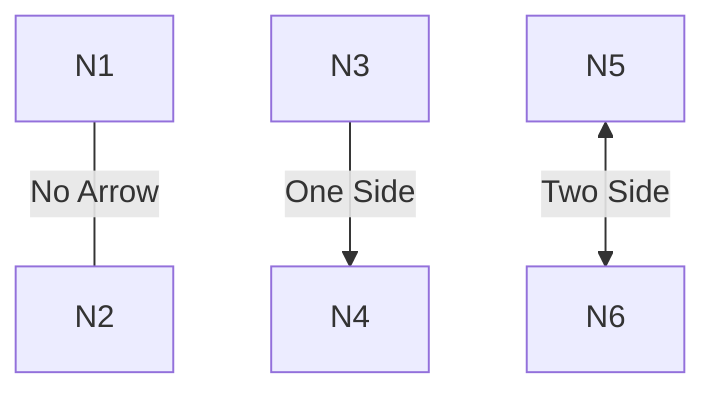

### 2. Link Length

~~~
```mermaid
flowchart
    N1[N1] --Small-- N2[N2]
    N3[N3] --Big--- N4[N4]
```
~~~

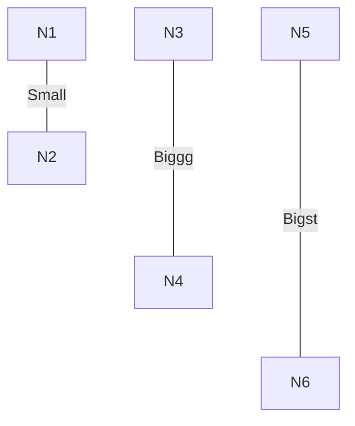

> [!TIP]
> - Adding more than 2 dashes on **left side** is an error: `---Text-->` Error.
> - But adding dashes on right side increases the length of the link: `--Text--->` Increase the length.


## 🧭 Flowchart Directions

Control the layout direction of your flowchart:

| Direction | Code | Description |
|-----------|------|-------------|
| Top-Down | `flowchart TD` | Vertical flow (default) |
| Top-Down | `flowchart TB` | Same as `TD` |
| Bottom-Top | `flowchart BT` | Vertical flow reversed |
| Left-Right | `flowchart LR` | Horizontal flow |
| Right-Left | `flowchart RL` | Horizontal flow reversed |

### Direction Examples

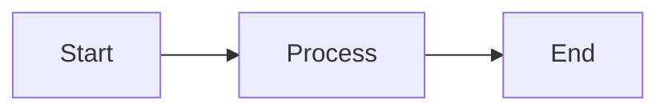

---

## 🔗 Links Between Nodes

Different link types connect nodes:

| Syntax | Type | Example |
|--------|------|---------|
| `A --> B` | Arrow | Directed link with arrowhead |
| `A --- B` | Open link | Line without arrowhead |
| `A -->&#124;text&#124;B` | Labeled arrow | Arrow with text label |
| `A -.- B` | Dotted link | Dashed line with arrow |
| `A == B` | Thick link | Bold line |
| `A ~~~ B` | Invisible link | Invisible (for positioning) |

### Link Examples

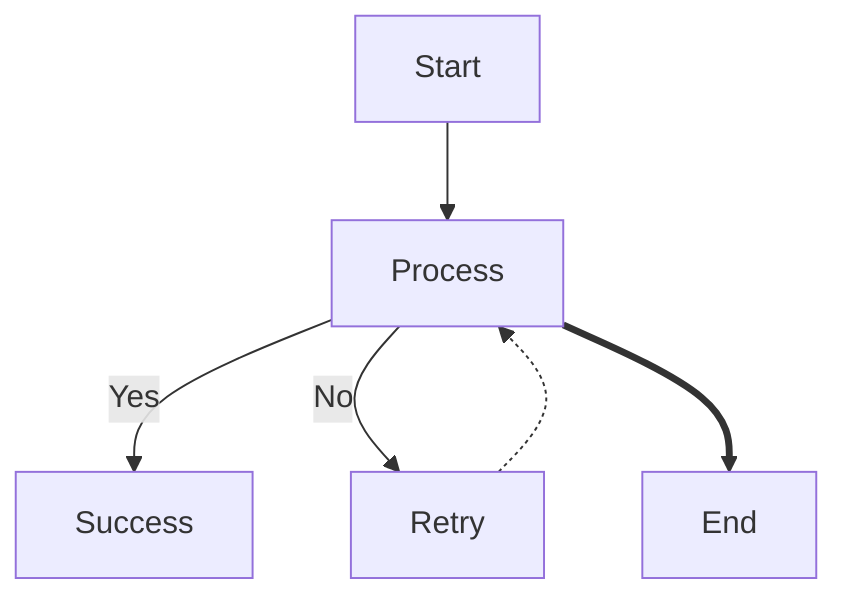

### Chaining Links

Connect multiple nodes in one statement:

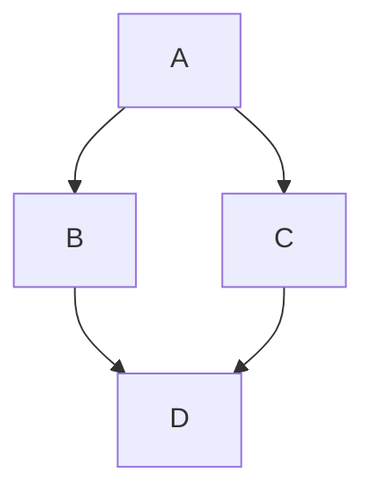

This is equivalent to:
```
A --> B
A --> C
B --> D
C --> D
```

---

## 🎯 Decision Nodes

Use diamond nodes (`{ }`) for decisions that branch logic:

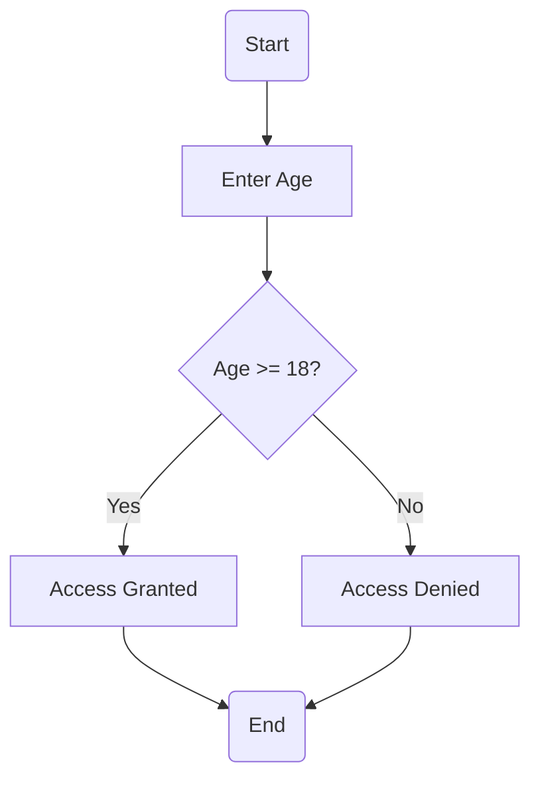

Label the paths with `|Yes|`, `|No|`, etc. to clarify conditions.

---

## 📦 Subgraphs for Grouping

Organize related nodes into logical groups:

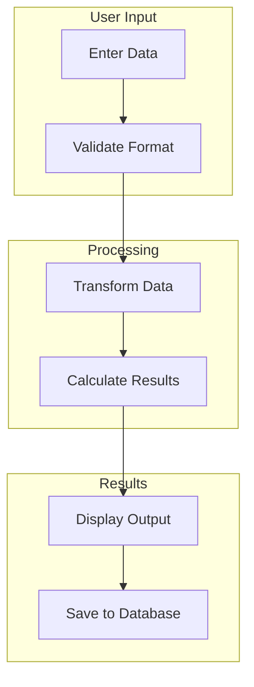

### Direction Within Subgraphs

Control the flow direction inside subgraphs:

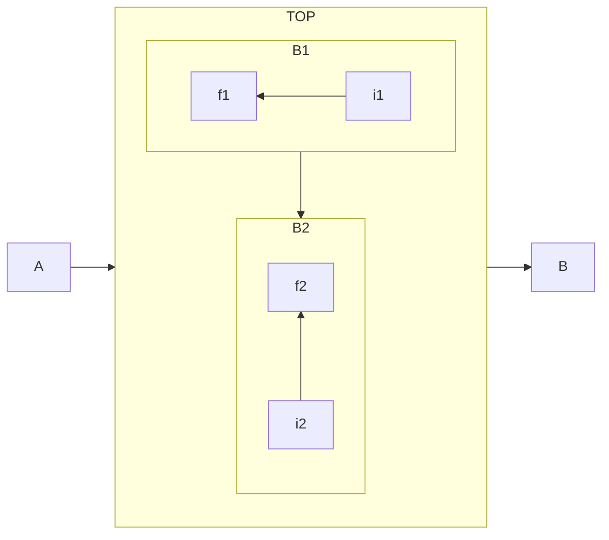

---

## 🎨 Styling & Coloring

### Inline Style

Apply CSS styles directly to nodes:

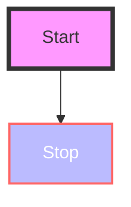

### Using Classes

Define reusable style classes:

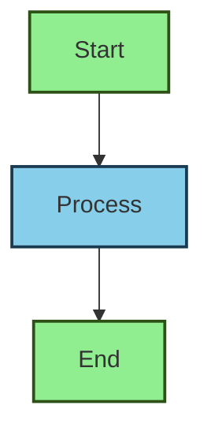

### Default Class

Apply a style to all nodes without a specific class:

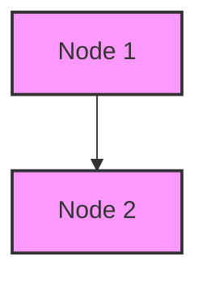

### Shorthand with `::`

Attach a class to a node using the `::` operator:

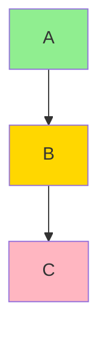

---

## 🎯 Real-World Example: E-Commerce Checkout

```mermaid
flowchart TD
    Start(Customer Visits Shop) --> Browse["Browse Products"]
    Browse --> AddCart{Add to Cart?}
    AddCart -->|No| Browse
    AddCart -->|Yes| Cart["View Cart"]
    Cart --> Checkout{Proceed to Checkout?}
    Checkout -->|No| Browse
    Checkout -->|Yes| Payment["Enter Payment Info"]
    Payment --> Validate{Payment Valid?}
    Validate -->|No| Error["Show Error"]
    Error --> Payment
    Validate -->|Yes| Success["Order Confirmed"]
    Success --> End(End)
    
    style Start fill:#e1f5e1,stroke:#2d5016,stroke-width:2px
    style Success fill:#e1f5e1,stroke:#2d5016,stroke-width:2px
    style End fill:#e1f5e1,stroke:#2d5016,stroke-width:2px
    style Error fill:#ffe1e1,stroke:#5d0016,stroke-width:2px
```

---

## 🧪 Practice Exercise

Create a flowchart for a **login system** that:

1. Prompts the user for username and password
2. Validates credentials against a database
3. Shows an error message if credentials are invalid (loop back to step 1)
4. Redirects to the dashboard if credentials are valid

**Tip:** Use decision nodes for validation and subgraphs to organize input/processing sections.

Try it in the [Mermaid Live Editor](https://mermaid.live) and experiment with different layouts and styles!

---

## 📚 Additional Resources

- **Official Mermaid Docs:** [Flowchart Syntax](https://mermaid.js.org/syntax/flowchart.html)
- **Curve Styles:** `basis`, `bumpX`, `bumpY`, `cardinal`, `catmullRom`, `linear`, `monotoneX`, `monotoneY`, `natural`, `step`, `stepAfter`, `stepBefore`
- **Font Awesome Icons:** Use `fa:fa-icon-name` in node text
- **Markdown Text:** Enable with config `htmlLabels: false` and use backticks for markdown formatting

---

**Next:** Explore [Sequence Diagrams](./sequence-diagram.md) for visualizing interactions between entities over time.
