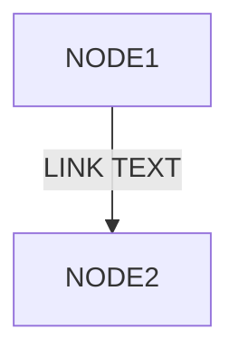
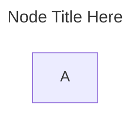
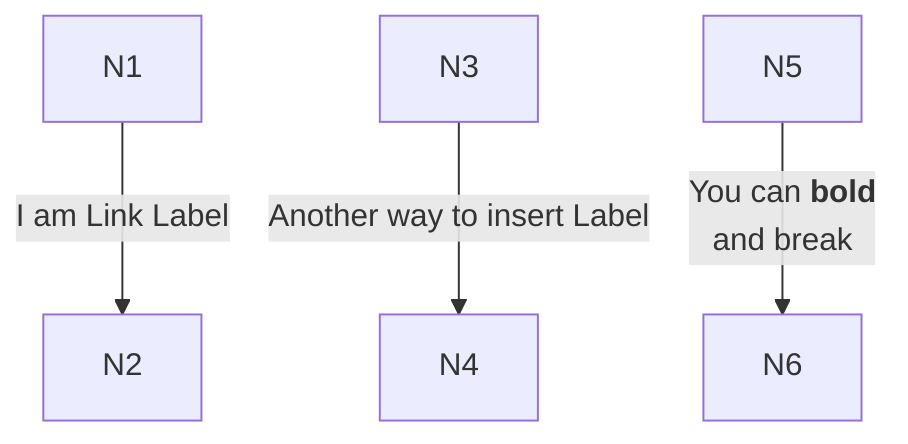
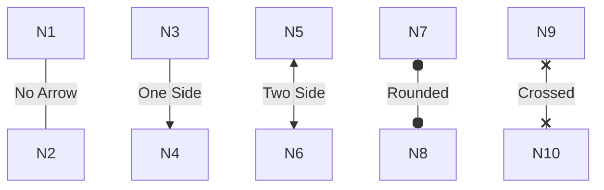
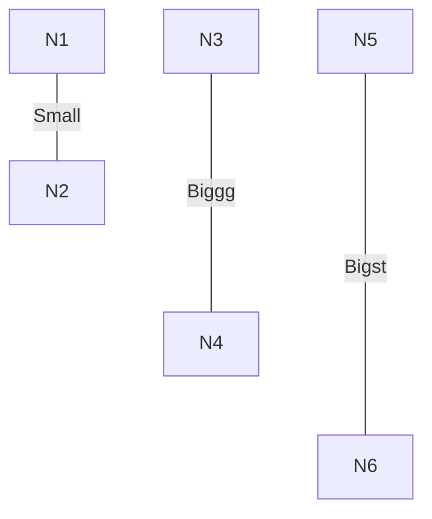
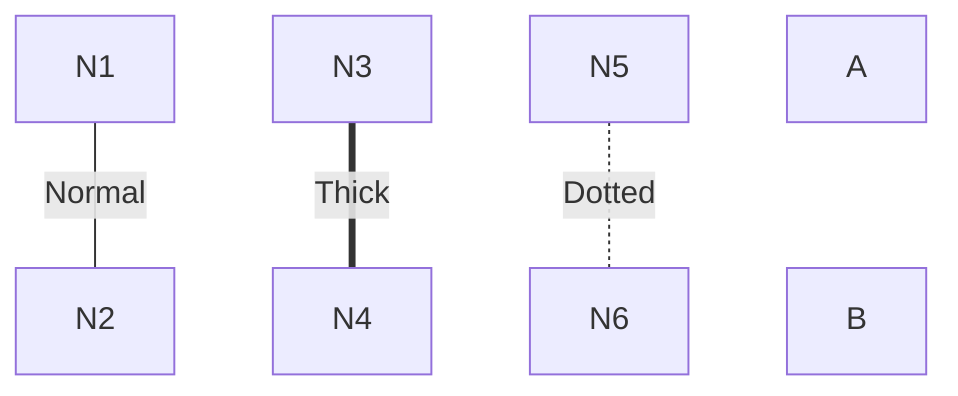
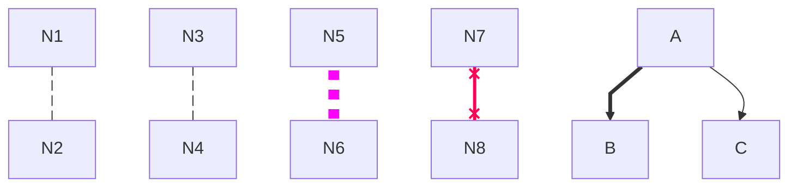

# 🔀 Flowchart Diagrams

A **flowchart** is a visual representation of a process or workflow using connected shapes and arrows. It shows the step-by-step flow of logic, decisions, and actions.

> [!Note]
> Use the official documentation for full details: [Official Documentation](https://mermaid.js.org/syntax/flowchart.html)

A simplest flowchart can be represented in **mermaid** using:
~~~
```mermaid
flowchart
flowchart
    NODE1 --LINK TEXT--> NODE2
```
~~~

And its visual diagram looks like:


It contains:
1. Node
2. Link
3. Link text

<br/>

# 📊 Title of `flowchart`

~~~

~~~


<br/><br/>


# 📐 Node Shapes Supported by `flowchart`

Mermaid supports many different node shapes. Some common examples are shown below:

### Example: Multiple Shapes

~~~

~~~
And the output is given below:


<br/><br/>

# 🔷 Another way to specify shapes

~~~
```mermaid
flowchart RL
    A@{ shape: manual-file, label: "File Handling"}
    B@{ icon: "fa:user", form: "square", label: "User Icon", pos: "t", h: 10, w: 10 }
~~~


```mermaid
flowchart RL
    A@{ shape: manual-file, label: "File Handling"}
    B@{ icon: "fa:user", form: "square", label: "User Icon", pos: "t", h: 10, w: 10 }
```

<br/><br/>

# 🧭 Flowchart Links

Nodes are connected using links.

### 1. Link labels:

Links can include descriptive text labels:

~~~

~~~

And the corresponding diagram looks like:


### 2. Link Arrows

~~~

~~~


### 3. Link Length

~~~

~~~


> [!TIP]
> - Adding more than 2 dashes on **left side** is an error: `---Text-->` Error.
> - But adding dashes on right side increases the length of the link: `--Text--->` Increase the length.

### 4. Link style

~~~
```mermaid
flowchart
    N1[N1] ---|Normal| N2[N2]
    N3[N3] ===|Thick| N4[N4]
    N5[N5] -.-|Dotted| N6[N6]
    N7[N7] ~~~ N8[N8]  // Invisibile link
```
~~~



### 6. Link styles with **Link Ids**

An **ID** can be assigned to a **link** using following format: `<LINK_ID>@---`  <br/>
Later, you can define a `classDef` with custom styles and can apply it to the `<LINK_ID>`

~~~

~~~


<br/><br/>

# 🧭 Flowchart Directions

Direction is the **direction of arrows.**

| No. | Direction              | Code           |
|-----|------------------------|----------------|
| 1   | Top-Down               | `flowchart TD` |
| 2   | Top-Down. Same as TD   | `flowchart TB` |
| 3   | Bottom-Top             | `flowchart BT` |
| 4   | Left-Right             | `flowchart LR` |
| 5   | Right-Left             | `flowchart RL` |

### Examples

### Top to Down: `flowchart TD`
~~~

~~~


<br/><br/>

### Top to Botton: `flowchart TB`
~~~

~~~

```mermaid
flowchart TB
    A --> B
```

<br/><br/>

### Bottom to Top: `flowchart BT`
~~~
```mermaid
flowchart BT
    A --> B
```
~~~

```mermaid
flowchart BT
    A --> B
```

<br/><br/>

### Left to Right: `flowchart LR`
~~~
```mermaid
flowchart LR
    A --> B
```
~~~

```mermaid
flowchart LR
    A --> B
```

<br/><br/>


### Top to Down: `flowchart RL`
~~~
```mermaid
flowchart RL
    A --> B
```
~~~

```mermaid
flowchart RL
    A --> B
```

<br/><br/>

# 📦 Subgraphs for Grouping

Organize related nodes into logical groups:

~~~
```mermaid
flowchart TB
    subgraph SG1
        direction LR
        A
        B
        A --> B
    end
    
    subgraph SG2
        direction RL
        C
        D
        C --> D
    end
    
    subgraph SG3
        direction TB
        E
        F
        E --> F
    end
    
    subgraph SG4
        direction BT
        G
        H
        G --> H
    end
    
    SG1 --> SG2 --> SG3 --> SG4
```
~~~

```mermaid
flowchart TB
    subgraph SG1
        direction LR
        A
        B
        A --> B
    end
    
    subgraph SG2
        direction RL
        C
        D
        C --> D
    end
    
    subgraph SG3
        direction TB
        E
        F
        E --> F
    end
    
    subgraph SG4
        direction BT
        G
        H
        G --> H
    end
    
    SG1 --> SG2 --> SG3 --> SG4
```

<br/>
<div style="font-size: 1.3em;">

## Direction and Positioning with (and without) Subgraphs

Position and direction **Algorithm:**
1. All _nodes with connected links_ considered as a **node-group**.
2. **nodes, node-groups and subgraphs** are **rendering objects**.
3. All rendering objects in _same level is a **rendering group**_ and is rendered together.
    - Then recursively _inner level rendering group_ is rendered.
4. **direction** of _rendering group_ declared with rendering groups, specifies:
    - direction of links.
    - how the **rendering objects** are ordered.

5. For the given **rendering group**, Loop through each rendering objects:
    - independent subgraphs (if no links are assosiated with them) rendered first.
        - There have **rendering group** inside subgraph.
        - Goto STEP:5 with the **rendering group** inside subgraph
    - Other independent **rendering objects** placed:
        - vertically, if **rendering group direction** is LR or RL
        - horizontally, if **rendering group direction** is TB, TD or BT
    - if a link started from a node inside **one rendering group** and ended in another node inside **another rendering group**:
        - _link and node_ direction is the direction of the **outer rendering group**.
    - Nodes and node-groups rendered using a best-space-utilization algorithm.
        - **direction of _nodes ordering_ is based on the direction of the rendering group**.
        - direction of _link arrows_ based on the direction of the rendering group.
</div>

**No direction**:

~~~
```mermaid
flowchart TD
    A
    B
```
~~~

```mermaid
flowchart TB
    A
    B
```
<br/><br/>

**With direction**:

~~~
```mermaid
flowchart TD
    A
    B
    A --> B
```
~~~

```mermaid
flowchart TD
    A
    B
    A --> B
```
<br/><br/>

**mixed direction**:

~~~
```mermaid
flowchart TB
    A
    B
    C
    D

    B --> C
```
~~~

```mermaid
flowchart TB
    A
    B
    C
    D

    B --> C
```
~~~
```mermaid
flowchart RL
    A
    B
    C
    D

    B --> C
```
~~~

```mermaid
flowchart RL
    A
    B
    C
    D

    B --> C
```

~~~
```mermaid
flowchart LR
    A
    B
    C
    D

    C --> D
```
~~~

```mermaid
flowchart LR
    A
    B
    C
    D

    C --> D
```

<br/><br/> 
**Subgaph directions:** simple

~~~
```mermaid
flowchart LR
    A
    subgraph SG1
        direction RL
        SG1N1 -->SG1N2
    end
    B
    C
    A-->B
```
~~~

```mermaid
flowchart LR
    A
    subgraph SG1
        direction RL
        SG1N1 -->SG1N2
    end
    B
    C
    A-->B
```

~~~
```mermaid
flowchart TB
    A
    subgraph SG1
        direction RL
        SG1N1 -->SG1N2
    end
    B
    C
    A-->B
```
~~~

```mermaid
flowchart TB
    A
    subgraph SG1
        direction RL
        SG1N1 -->SG1N2
    end
    B
    C
    A-->B
```

<br/><br/>
**Subgaph directions:** link between nodes - no subgraph links
~~~
```mermaid
flowchart RL
    A
    subgraph SG1
        direction RL
        SG1N1 -->SG1N2
    end
    B

    A-->B
```
~~~

```mermaid
flowchart RL
    A
    subgraph SG1
        direction RL
        SG1N1 -->SG1N2
    end
    B

    A-->B
```

<br/><br/>
**Subgaph directions:** link between nodes and subgraphs
~~~
```mermaid
flowchart LR
    A
    subgraph SG1
        direction RL
        SG1N1 --> SG1N2
    end
    B

    A-->B-->SG1
```
~~~

```mermaid
flowchart LR
    A
    subgraph SG1
        direction RL
        SG1N1 --> SG1N2
    end
    B

    A-->B-->SG1
```

<br/>

~~~
```mermaid
flowchart TB
    A
    subgraph SG1
        direction RL
        SG1N1 --> SG1N2
    end
    B

    A-->B-->SG1
```
~~~


```mermaid
flowchart TB
    A
    subgraph SG1
        direction RL
        SG1N1 --> SG1N2
    end
    B

    A-->B-->SG1
```

<br/><br/>
**Subgaph directions:** link between **nodes and subgraph nodes**<br/>

> [!NOTE] See subgraph direction is not used, it is taking **direction of parent rendering group**

~~~
```mermaid
flowchart TB
    A
    subgraph SG1
        direction RL
        SG1N1 --> SG1N2
    end
    B

    A-->B-->SG1N1
```
~~~


```mermaid
flowchart TB
    A
    subgraph SG1
        direction RL
        SG1N1 --> SG1N2
    end
    B

    A-->B-->SG1N1
```

<br/><br/>
**Chaining Links:** Connect multiple nodes in one statement<br/>

~~~
```mermaid
flowchart TD
    A --> B & C --> D
```

This is equivalent to:
```
A --> B
A --> C
B --> D
C --> D
```
~~~

```mermaid
flowchart TD
    A --> B & C --> D
```

This is equivalent to:
```
A --> B
A --> C
B --> D
C --> D
```

<br/>

## 🎨 Styling & Coloring

### 1. Using CSS:

**Apply CSS styles to nodes using IDs**

~~~
```mermaid
flowchart TD
    id1[Start] --> id2[Stop]

    style id1 fill:#f9f,stroke:#333,stroke-width:4px
    style id2 fill:#bbf,stroke:#f66,stroke-width:2px,color:#fff
```
~~~

```mermaid
flowchart TD
    id1[Start] --> id2[Stop]

    style id1 fill:#f9f,stroke:#333,stroke-width:4px
    style id2 fill:#bbf,stroke:#f66,stroke-width:2px,color:#fff
```

### 2. Using Classes:

**Define reusable style classes using `classDef` and apply using `:::`**

~~~
```mermaid
flowchart TD
    A[Start]:::success --> B[Process]:::info --> C[End]:::success
    
    classDef success fill:#90EE90,stroke:#2d5016,stroke-width:2px
    classDef info fill:#87CEEB,stroke:#1a3a52,stroke-width:2px
```
~~~
```mermaid
flowchart TD
    A[Start]:::success --> B[Process]:::info
    
    classDef success fill:#90EE90,stroke:#2d5016,stroke-width:2px
    classDef info fill:#87CEEB,stroke:#1a3a52,stroke-width:2px
```

<br/><br/>

**Apply a calss to an ID**

```
```mermaid
flowchart TD
    A[Start] --> B[Process]
    
    classDef success fill:yellow,stroke:black,stroke-width:2px
    classDef info fill:cyan,stroke:red,stroke-width:2px

    class A success
    class B info
```

```mermaid
flowchart TD
    A[Start] --> B[Process]
    
    classDef success fill:yellow,stroke:black,stroke-width:2px
    classDef info fill:cyan,stroke:red,stroke-width:2px

    class A success
    class B info
```

<br/><br/>


**Default Class**

~~~
```mermaid
flowchart TD
    A[Node 1] --> B[Node 2]

    classDef default fill:#f9f,stroke:#333,stroke-width:2px
```
~~~

```mermaid
flowchart TD
    A[Node 1] --> B[Node 2]

    classDef default fill:#f9f,stroke:#333,stroke-width:2px
```


