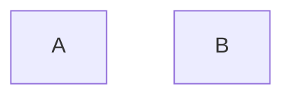
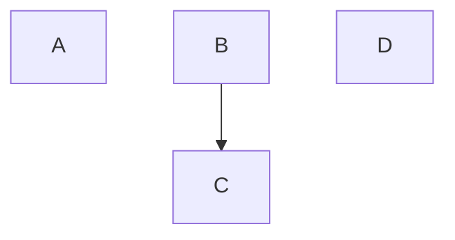
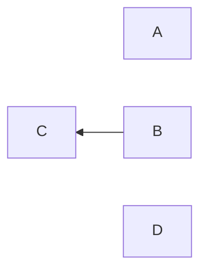
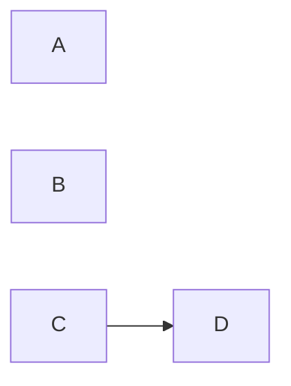
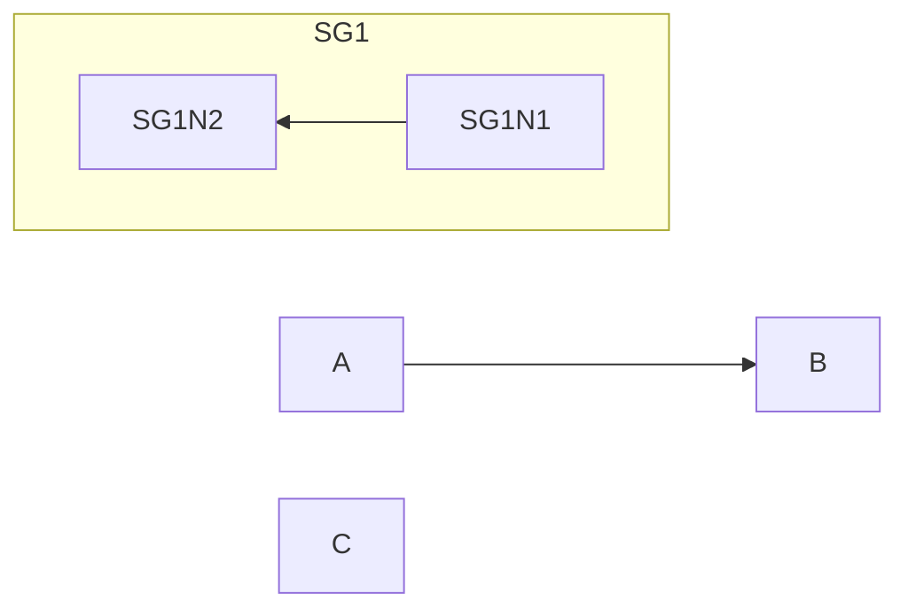
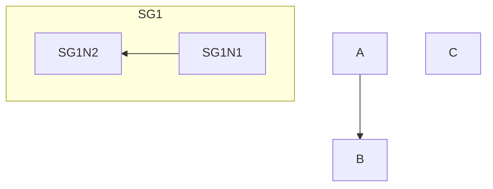
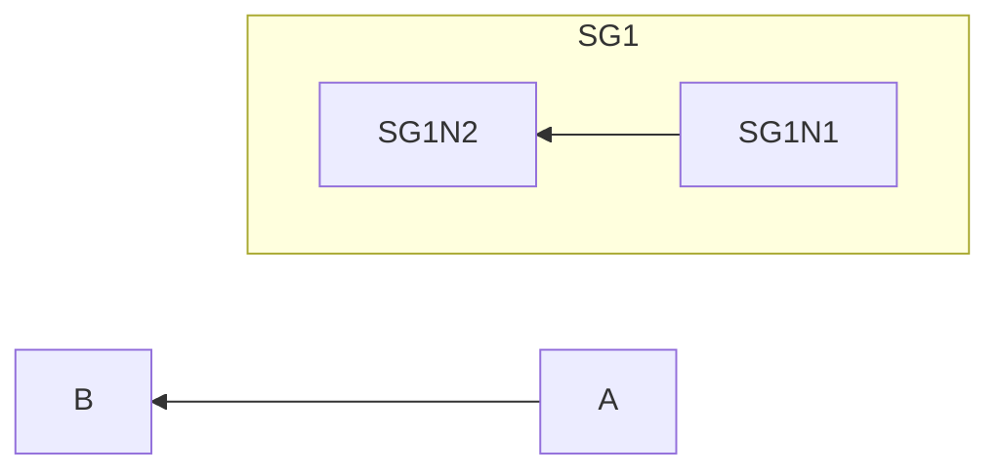
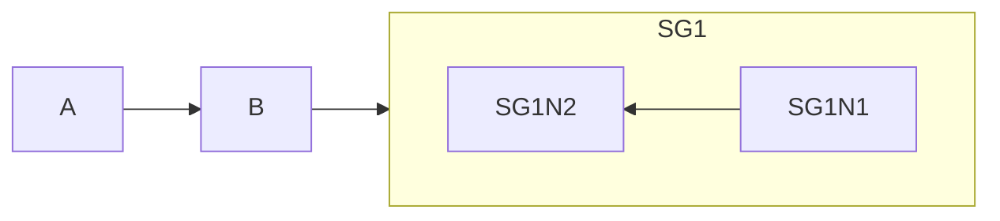
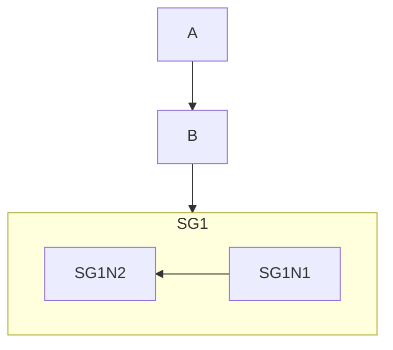

# 🔀 Flowchart Diagrams

## On this page

- [Direction and Positioning with (and without) Subgraphs](#direction-and-positioning-with-and-without-subgraphs)
- [🎨 Flowchart specific configurations](#flowchart-specific-configurations)
- [`nodeSpacing` and `rankSpacing`](#nodespacing-and-rankspacing)
- [`curve` example](#curve-example)
- [`diagramPadding`](#diagrampadding)
- [`htmlLabels`](#htmllabels)
- [`useMaxWidth`](#usemaxwidth)
- [`wrap`](#wrap)
- [`titleTopMargin`](#titletopmargin)

## Direction and Positioning with (and without) Subgraphs

Position and direction **Algorithm:**
1. All _nodes with connected links_ considered as a **node-group**.
2. **nodes, node-groups and subgraphs** are **rendering objects**.
3. All rendering objects in _same level is a **rendering group**_ and is rendered together.
    - Then recursively _inner level rendering group_ is rendered.
4. **direction** of _rendering group_ declared with rendering groups, specifies:
    - direction of links.
    - how the **rendering objects** are ordered.

5. For the given **rendering group**, Loop through each rendering objects:
    - independent subgraphs (if no links are assosiated with them) rendered first.
        - There have **rendering group** inside subgraph.
        - Goto STEP:5 with the **rendering group** inside subgraph
    - Other independent **rendering objects** placed:
        - vertically, if **rendering group direction** is LR or RL
        - horizontally, if **rendering group direction** is TB, TD or BT
    - if a link started from a node inside **one rendering group** and ended in another node inside **another rendering group**:
        - _link and node_ direction is the direction of the **outer rendering group**.
    - Nodes and node-groups rendered using a best-space-utilization algorithm.
        - **direction of _nodes ordering_ is based on the direction of the rendering group**.
        - direction of _link arrows_ based on the direction of the rendering group.
</div>

**No direction**:

~~~

```mermaid
flowchart TD
    A
    B
```
~~~


```mermaid
flowchart TB
    A
    B
```
<br/><br/>

**With direction**:

~~~

```mermaid
flowchart TD
    A
    B
    A --> B
```
~~~


```mermaid
flowchart TD
    A
    B
    A --> B
```
<br/><br/>

**mixed direction**:

~~~

```mermaid
flowchart TB
    A
    B
    C
    D

    B --> C
```
~~~


```mermaid
flowchart TB
    A
    B
    C
    D

    B --> C
```
~~~

```mermaid
flowchart RL
    A
    B
    C
    D

    B --> C
```
~~~


```mermaid
flowchart RL
    A
    B
    C
    D

    B --> C
```

~~~

```mermaid
flowchart LR
    A
    B
    C
    D

    C --> D
```
~~~


```mermaid
flowchart LR
    A
    B
    C
    D

    C --> D
```

<br/><br/> 
**Subgaph directions:** simple

~~~

```mermaid
flowchart LR
    A
    subgraph SG1
        direction RL
        SG1N1 -->SG1N2
    end
    B
    C
    A-->B
```
~~~


```mermaid
flowchart LR
    A
    subgraph SG1
        direction RL
        SG1N1 -->SG1N2
    end
    B
    C
    A-->B
```

~~~

```mermaid
flowchart TB
    A
    subgraph SG1
        direction RL
        SG1N1 -->SG1N2
    end
    B
    C
    A-->B
```
~~~


```mermaid
flowchart TB
    A
    subgraph SG1
        direction RL
        SG1N1 -->SG1N2
    end
    B
    C
    A-->B
```

<br/><br/>
**Subgaph directions:** link between nodes - no subgraph links
~~~

```mermaid
flowchart RL
    A
    subgraph SG1
        direction RL
        SG1N1 -->SG1N2
    end
    B

    A-->B
```
~~~


```mermaid
flowchart RL
    A
    subgraph SG1
        direction RL
        SG1N1 -->SG1N2
    end
    B

    A-->B
```

<br/><br/>
**Subgaph directions:** link between nodes and subgraphs
~~~

```mermaid
flowchart LR
    A
    subgraph SG1
        direction RL
        SG1N1 --> SG1N2
    end
    B

    A-->B-->SG1
```
~~~


```mermaid
flowchart LR
    A
    subgraph SG1
        direction RL
        SG1N1 --> SG1N2
    end
    B

    A-->B-->SG1
```

<br/>

~~~

```mermaid
flowchart TB
    A
    subgraph SG1
        direction RL
        SG1N1 --> SG1N2
    end
    B

    A-->B-->SG1
```
~~~


```mermaid
flowchart TB
    A
    subgraph SG1
        direction RL
        SG1N1 --> SG1N2
    end
    B

    A-->B-->SG1
```

<br/><br/>
**Subgaph directions:** link between **nodes and subgraph nodes**<br/>

> [!NOTE]
> See subgraph direction is not used, it is taking **direction of parent rendering group**

~~~
```mermaid
flowchart TB
    A
    subgraph SG1
        direction RL
        SG1N1 --> SG1N2
    end
    B

    A-->B-->SG1N1
```
~~~


```mermaid
flowchart TB
    A
    subgraph SG1
        direction RL
        SG1N1 --> SG1N2
    end
    B

    A-->B-->SG1N1
```

<br/><br/>
**Chaining Links:** Connect multiple nodes in one statement<br/>

~~~
```mermaid
flowchart TD
    A --> B & C --> D
```

This is equivalent to:
```
A --> B
A --> C
B --> D
C --> D
```
~~~

```mermaid
flowchart TD
    A --> B & C --> D
```

This is equivalent to:
```
A --> B
A --> C
B --> D
C --> D
```

<br/><br/>

# 🎨 Flowchart specific configurations

| **Option**            | **Type**   | **Description**                                                                 |
|------------------------|------------|---------------------------------------------------------------------------------|
| `diagramPadding`       | Number     | Padding around the entire diagram.                                              |
| `nodeSpacing`          | Number     | Horizontal spacing between nodes.                                               |
| `rankSpacing`          | Number     | Vertical spacing between ranks (levels).                                        |
| `curve`                | String     | Edge curve style (`basis`, `linear`, `cardinal`, `monotoneX`, `monotoneY`, `stepBefore`, `stepAfter`). |
| `defaultRenderer`      | String     | Rendering engine (`dagre` or `elk`).                                            |
| `htmlLabels`           | Boolean    | Enables HTML-based labels for richer styling.                                   |
| `useMaxWidth`          | Boolean    | Scale diagram to container width.                                               |
| `wrap`                 | Boolean    | Wraps long text inside nodes.                                                   |
| `titleTopMargin`       | Number     | Margin above the diagram title.                                                 |
| `padding`              | Number     | Extra padding around diagram.                                                   |
| `spacing`              | Number     | General spacing between elements.                                               |
| `minlen`               | Number     | Minimum edge length.                                                            |
| `edgeSpacingFactor`    | Number     | Factor controlling edge spacing.                                                |
| `ranker`               | String     | Ranker algorithm (`network-simplex`, `tight-tree`, `longest-path`).             |
| `dagreAlgo`            | String     | Algorithm used by Dagre layout.                                                 |
| `elk`                  | Object     | ELK-specific configuration (algorithm, node placement strategy, etc.).          |


<br/>

### `nodeSpacing` and `rankSpacing`

~~~
```mermaid
%%{init: {'flowchart': {'nodeSpacing': 30, 'rankSpacing': 80}}}%%
flowchart LR
    A[Start] --> B[Process]
    A --> C[Alternative]
    B --> D[End]
    C --> D
```


```mermaid
%%{init: {'flowchart': {'nodeSpacing': 150, 'rankSpacing': 80}}}%%
flowchart LR
    A[Start] --> B[Process]
    A --> C[Alternative]
    B --> D[End]
    C --> D
```
~~~

```mermaid
%%{init: {'flowchart': {'nodeSpacing': 30, 'rankSpacing': 80}}}%%
flowchart LR
    A[Start] --> B[Process]
    A --> C[Alternative]
    B --> D[End]
    C --> D
```


```mermaid
%%{init: {'flowchart': {'nodeSpacing': 150, 'rankSpacing': 80}}}%%
flowchart LR
    A[Start] --> B[Process]
    A --> C[Alternative]
    B --> D[End]
    C --> D
```

<br/>

### `curve` example
```mermaid
---
title: basis
---
%%{init: {'flowchart': {'curve': 'basis'}}}%%
flowchart LR
    A[Start] --> B[Process]
    A --> C[Alternative]
    B --> D[End]
    C --> D
```

<br/><br/>

```mermaid
---
title: linear
---
%%{init: {'flowchart': {'curve': 'linear'}}}%%
flowchart LR
    A[Start] --> B[Process]
    A --> C[Alternative]
    B --> D[End]
    C --> D
```

<br/><br/>

```mermaid
---
title: cardinal
---
%%{init: {'flowchart': {'curve': 'cardinal'}}}%%
flowchart LR
    A[Start] --> B[Process]
    A --> C[Alternative]
    B --> D[End]
    C --> D
```

<br/><br/>
```mermaid
---
title: stepBefore
---
%%{init: {'flowchart': {'curve': 'stepBefore'}}}%%
flowchart LR
    A[Start] --> B[Process]
    A --> C[Alternative]
    B --> D[End]
    C --> D
```

<br/><br/>

### `diagramPadding`

```mermaid
---
title: diagramPadding=8
---
%%{init: {'flowchart': {'diagramPadding': 8}}}%%
flowchart LR
    A[Start] --> B[Process]
    B --> C[End]
```

```mermaid
---
title: diagramPadding=50
---
%%{init: {'flowchart': {'diagramPadding': 50}}}%%
flowchart LR
    A[Start] --> B[Process]
    B --> C[End]
```

### `htmlLabels`
> [!TIP]
> Not working in VS Code

```mermaid
---
title: htmlLabels=true
---
%%{init: {'flowchart': {'htmlLabels': true}}}%%
flowchart TD
    A["<b>Start</b><br/>with HTML"] --> B["<i>Process</i> <br/> <a href='https://mermaid.js.org'>Mermaid Docs</a>"]
    B --> C["<span style='color:red'>End</span>"]
```

<br/>

```mermaid
---
title: htmlLabels=false
---
%%{init: {'flowchart': {'htmlLabels': false}}}%%
flowchart TD
    A["<b>Start</b><br/>with HTML"] --> B["<i>Process</i> <br/> <a href='https://mermaid.js.org'>Mermaid Docs</a>"]
    B --> C["<span style='color:red'>End</span>"]
```

<br/>

### `useMaxWidth`

Resize the rendered window to see the change in effect.

```mermaid
---
title: useMaxWidth=true
---
%%{init: {'flowchart': {'useMaxWidth': true}}}%%
flowchart LR
    A[Start] --> B[Process]
    B --> C[End]
```


```mermaid
---
title: useMaxWidth=false
---
%%{init: {'flowchart': {'useMaxWidth': false}}}%%
flowchart LR
    A[Start] --> B[Process]
    B --> C[End]
```

<br/><br/>

### `wrap`

> [!TIP]
> not working in vs-code

```mermaid
---
title: wrap=true
---
%%{init: {'flowchart': {'wrap': true}}}%%
flowchart TD
    A["This is a very long sentence that will wrap neatly inside the node"]
    B["Another long label that wraps automatically"]
    A --> B
```

```mermaid
---
title: wrap=false
---
%%{init: {'flowchart': {'wrap': false}}}%%
flowchart TD
    A["This is a very long sentence that will NOT wrap neatly inside the node"]
    B["Another long label that stays on one line"]
    A --> B
```

<br/><br/>

### `titleTopMargin`

```mermaid
---
title: titleTopMargin=5
---
%%{init: {'flowchart': {'titleTopMargin': 5}}}%%
flowchart LR
    A[Start] --> B[Process]
    B --> C[End]
```

<br/><br/>

```mermaid
---
title: titleTopMargin=100
---
%%{init: {'flowchart': {'titleTopMargin': 100}}}%%
flowchart LR
    A[Start] --> B[Process]
    B --> C[End]
```

<p align="right">
    <a href="../../README.md">Home</a>
    &nbsp;|&nbsp;
    <a href="../README.md">Back to Mermaid Index</a>
</p>
