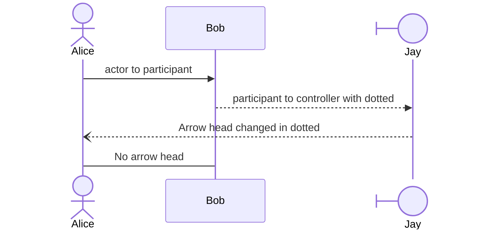
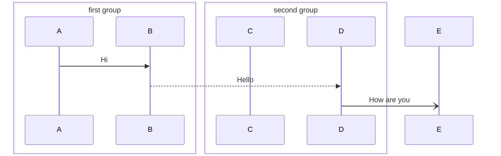
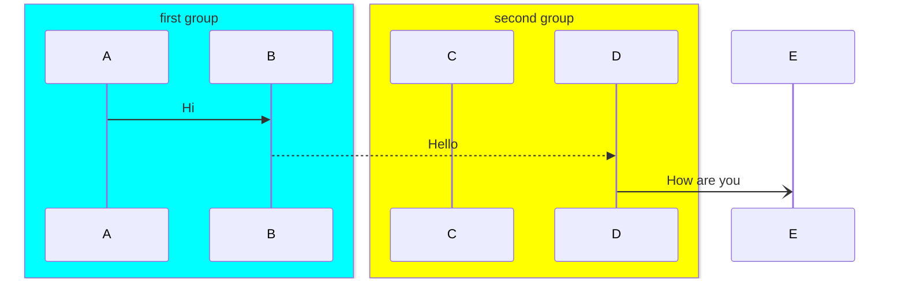
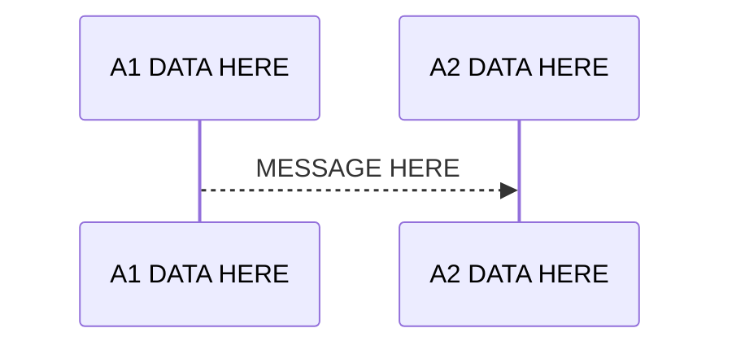
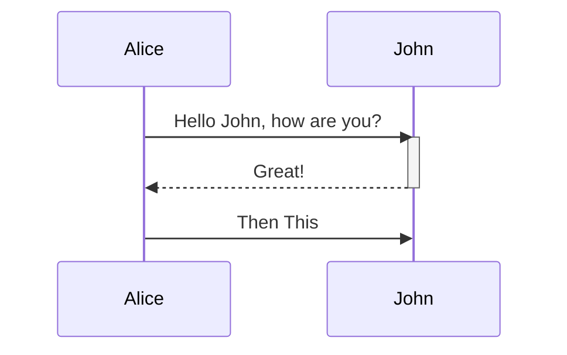
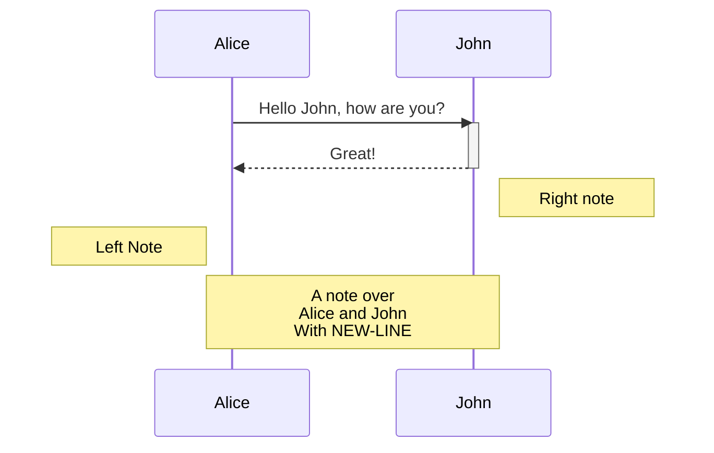
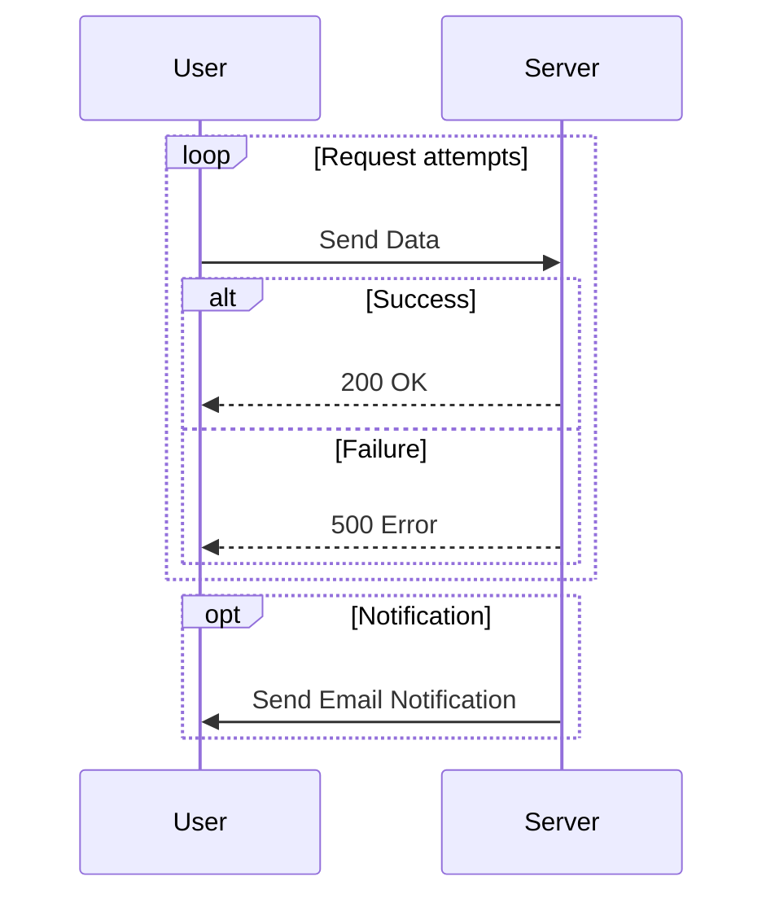
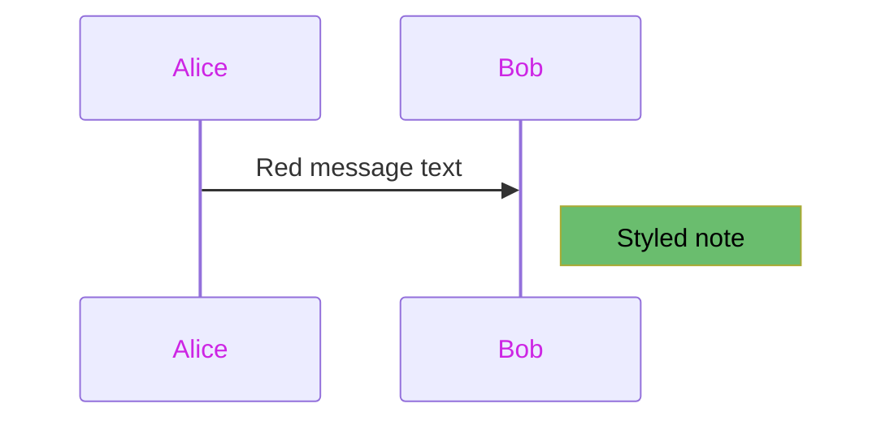

# Sequence Daigram

Sequence diagrams are used to show **how processes operate with one another** and the order in which they occur.
An example is given below:

~~~

~~~

## 🚀 Components of sequence diagrams

Sequence diagram, started using `sequenceDiagram` code block (as given above).

### 1. Actor
An actor represents a human or external entity entering the process.

Eg: `actor Alice`

### 2. Participant

eg: `participant Bob`

Different types of participants:

| Type | Syntax |
|------|--------|
| Normal | `participant Bob` |
| Boundary | `participant Alice@{ "type" : "boundary" }` |
| Control | `participant Alice@{ "type" : "control" }` |
| Entity | `participant Alice@{ "type" : "entity" }` |
| Database | `participant Alice@{ "type" : "database" }` |
| Collections | `participant Alice@{ "type" : "collections" }` |
| Queue | `participant Alice@{ "type" : "queue" }` |

### 3. Arrows
Different types of arrows.

| Type | Description |
|------|-------------|
| `->` | Solid line without arrow |
| `-->` | Dotted line without arrow |
| `->>` | Solid line with arrowhead |
| `-->>` | Dotted line with arrowhead |
| `<<->>` | Solid line with bidirectional arrowheads (v11.0.0+) |
| `<<-->>` | Dotted line with bidirectional arrowheads (v11.0.0+) |
| `-x` | Solid line with a cross at the end |
| `--x` | Dotted line with a cross at the end |
| `-)` | Solid line with an open arrow at the end (async) |
| `--)` | Dotted line with an open arrow at the end (async) |

### 4. Grouping / Box

~~~

~~~

### 5. Aliases
You can create alias to long captions

~~~

~~~

### 6. Activations

~~~

~~~

### 7. Notes

| Placement | Syntax |
| :--- | :--- |
| **Left/Right** | `Note right of John: Text on the right` |
| **Over One** | `Note over Alice: Text over Alice` |
| **Over Two** | `Note over Alice,John: Text spanning both` |

~~~

~~~

### 8. Combined Fragments (Loops, Alternatives, Parallel)

These blocks are used to show conditional, repetitive, or parallel behavior. They must always end with the `end` keyword.

| Fragment | Syntax | Description |
| :--- | :--- | :--- |
| **Loop** | `loop <condition>...end` | Repeats a sequence while a condition is true. |
| **Alternative** | `alt <condition>...else...end` | Shows conditional paths based on a condition. |
| **Optional** | `opt <condition>...end` | Shows a sequence that may or may not execute (similar to an `if` without `else`). |
| **Parallel** | `par <action1>...and <action2>...end` | Shows actions that occur concurrently. |
| **Critical** | `critical <section>...end` | Marks a critical section that must not be interrupted. |

~~~

~~~

## 🎨 Mermaid `sequenceDiagram` Styling Variables with Example Values

Most of the below given styles are unformly not supported across different renderers. You can use after verifying and testing.

| Category       | Variable Name              | Purpose / Effect | Example Value |
|----------------|----------------------------|------------------|---------------|
| **Participants (Actors)** | `actorBorderColor` | Border color of participant boxes | `#333333` |
|                | `actorTextColor`          | Text color inside participant boxes | `#ffffff` |
|                | `actorBackgroundColor`    | Background fill color of participant boxes | `#007acc` |
|                | `actorLineColor`          | Line color of participant lifelines | `#999999` |
| **Messages (Arrows)** | `messageLineColor`        | Color of message lines (arrows) | `#ff6600` |
|                | `messageTextColor`        | Text color of message labels | `#333333` |
|                | `messageArrowColor`       | Arrowhead color | `#ff6600` |
|                | `signalColor`             | Color of signals (alternative arrow styling) | `#00cc99` |
| **Notes**      | `noteBorderColor`         | Border color of notes | `#666666` |
|                | `noteTextColor`           | Text color inside notes | `#000000` |
|                | `noteBkgColor`            | Background fill color of notes | `#ffffcc` |
| **Labels & Loops** | `labelTextColor`          | Text color for labels (e.g., alt/opt blocks) | `#222222` |
|                | `labelBoxBorderColor`     | Border color of label boxes | `#444444` |
|                | `labelBoxBkgColor`        | Background color of label boxes | `#e6e6e6` |
|                | `loopTextColor`           | Text color for loop labels | `#cc0000` |
| **General Diagram** | `backgroundColor`         | Overall diagram background | `#f9f9f9` |
|                | `lineColor`               | Default line color | `#000000` |
|                | `fontFamily`              | Font family used in diagram | `"Arial"` |
|                | `fontSize`                | Font size for text | `14px` |
|                | `textColor`               | General text color (fallback) | `#111111` |
|                | `mainBkg`                 | Main background color (global) | `#ffffff` |
|                | `nodeBorder`              | Border color for nodes (applies broadly) | `#cccccc` |

