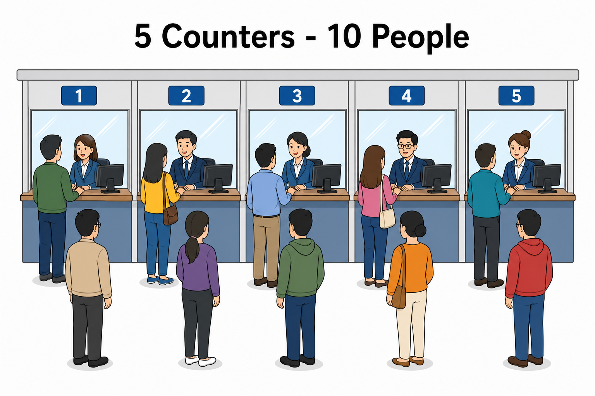
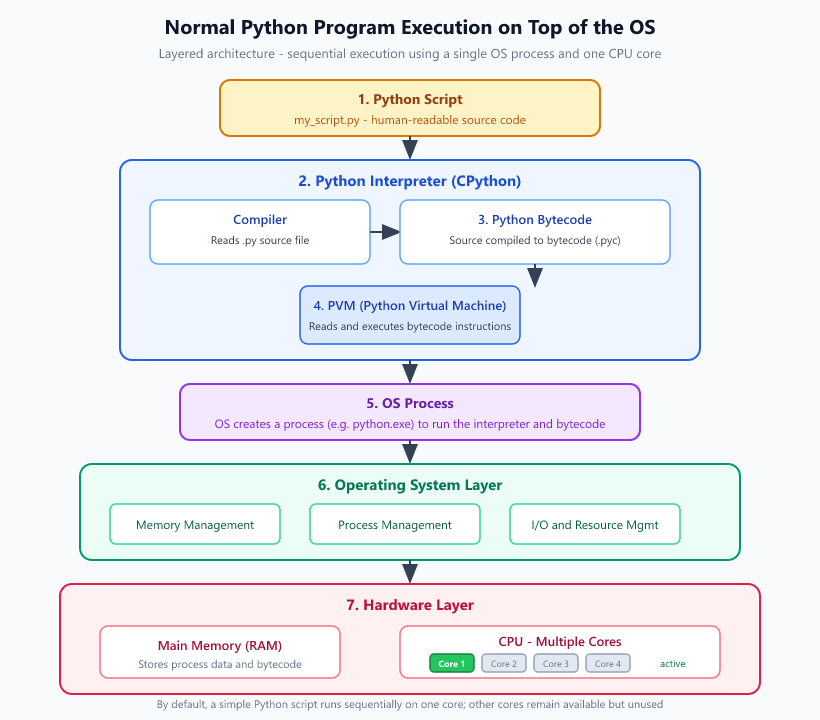
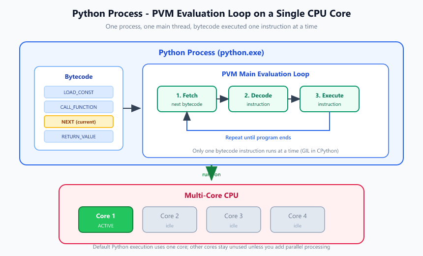
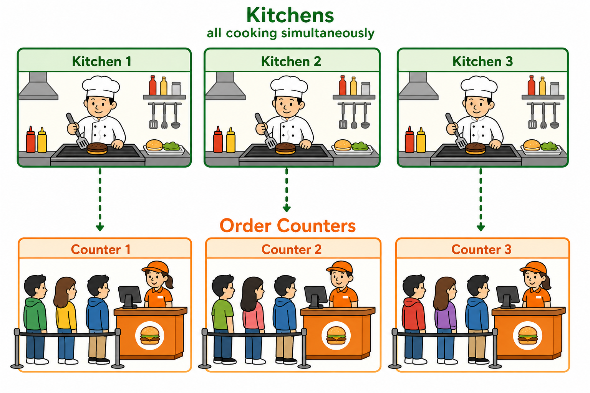
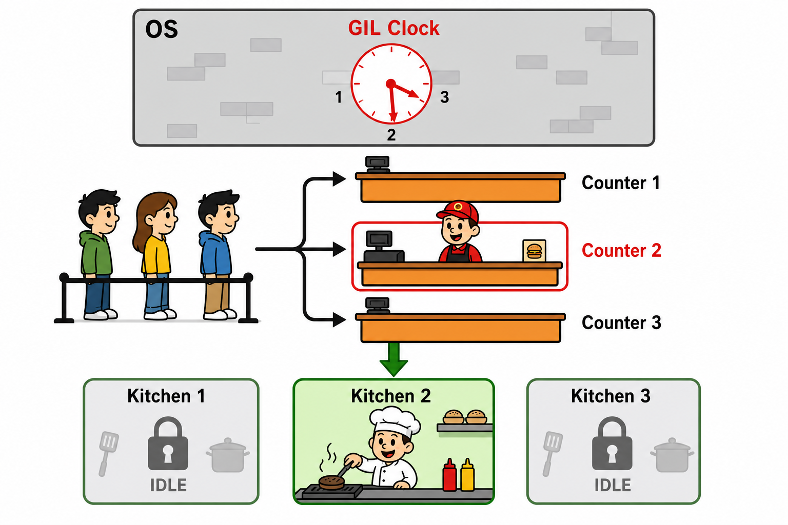
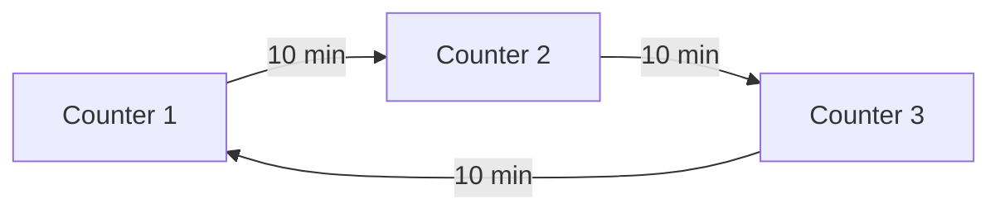
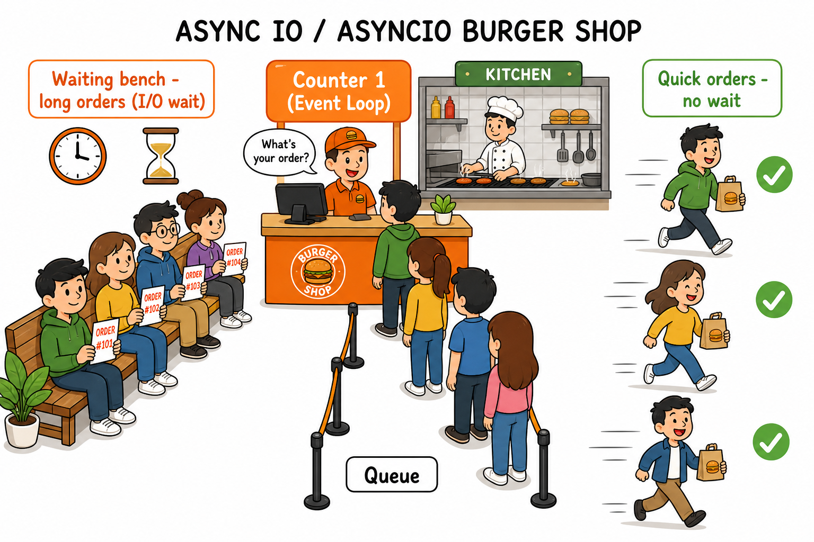

# Parallel Processing in Python

<p align="center">
    
</p>

<p align="center"><strong>Fig:</strong> Sequential processing</p>

<br>

<p align="center">
    
</p>

<p align="center"><strong>Fig:</strong> Parallel processing</p>

The two images above show the basic difference between the **default sequential way** of running a program and the **parallel way**.

In sequential processing, tasks are done **one after another** by a single worker — like one counter serving 10 people in a single queue. In parallel processing, the same work is split across **multiple workers** that run at the same time — like 5 counters each serving people together. When the tasks do not depend on each other, parallel execution can finish the full job sooner.

Now, let's see this in depth.

# How Does Python Execute a Program?

<p align="center">
    
</p>

<p align="center"><strong>Fig:</strong> Normal Python program execution layered on top of the operating system</p>

To run a simple Python script, you use a command like this:

```bash
python my_script.py
```

### Here is what happens in simple terms:

- **`python`** — This is the Python program. Consider it as a builder function that connect different parts of python.
- **`my_script.py`** — This is your script file. It contains the Python code you wrote.
- When you run the command, `my_script.py` is passed to the `python` as a **command-line argument** along with other parameters.

### Internal steps that take place

When you run the command, these steps happen inside the system:

1. **OS creates a process**  
   The operating system starts a new process for the Python executable (for example, `python.exe`).

2. **Core environment is initialized**  
   - Memory is allocated  
   - Internal data structures are set up  
   - System paths are configured

3. **PVM starts**  
   The Python Virtual Machine (PVM) is ready to run your program.

4. **Source is compiled to bytecode**  
   - The interpreter reads and parses `my_script.py`  
   - The source code is compiled into **bytecode** (`.pyc`)

5. **PVM executes the bytecode**  
   The PVM runs a main evaluation loop. For each instruction, it:
   1. **Fetches** the next bytecode instruction  
   2. **Decodes** the instruction  
   3. **Executes** the instruction  

   This loop repeats until the program finishes.

<br>

<p align="center">
    
</p>

<p align="center"><strong>Fig:</strong> Python process PVM loop fetching and executing bytecode on a single CPU core</p>

# Types of Parallel Processing in Python

By default, Python runs your program on **one CPU core**, in **one process**, with **one main thread**. To use more cores or handle many tasks at the same time, Python gives you a few different options.

1. Multiprocessing
2. Multithreading
3. Async I/O (Asyncio)

## Multiprocessing

<p align="center">
    
</p>

<p align="center"><strong>Fig:</strong> Multiprocessing - All kitchens cook burgers at the same time</p>


## Multithreading

<p align="center">
    
</p>

<p align="center"><strong>Fig:</strong> Multithreading - three counters but shared kitchen. GIL clock picks one counter for cooking its food; only one shared kitchen cooks at a time</p>

The **GIL clock** gives each counter a turn to cook — say **10 minutes** per counter:




## Async I/O (Asyncio)

<p align="center">
    
</p>

<p align="center"><strong>Fig:</strong> Async I/O - one counter; quick orders leave immediately, long-wait orders sit on the bench while the counter keeps serving</p>
