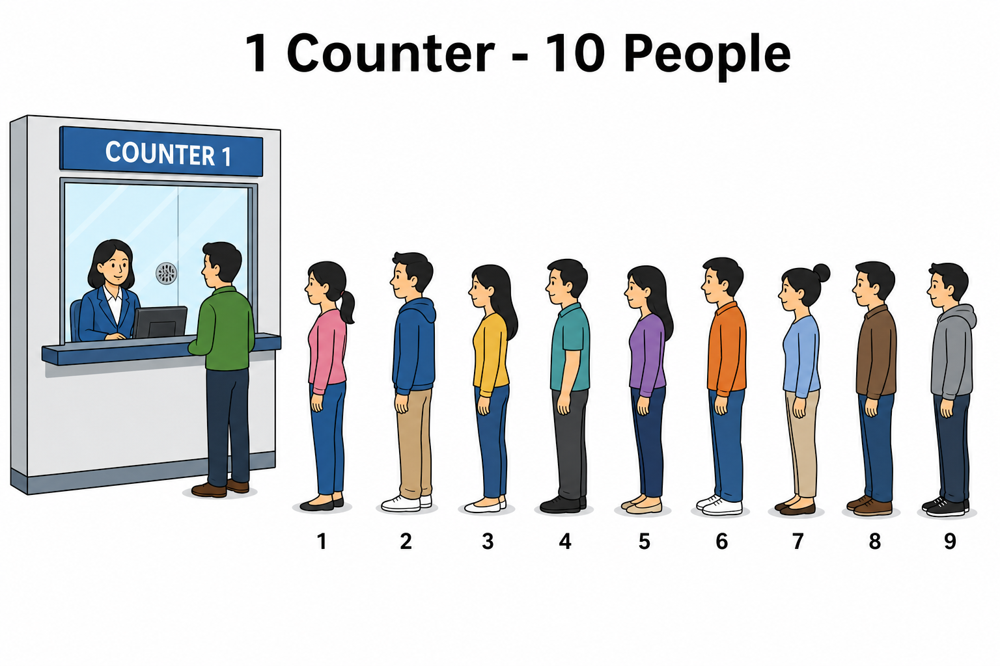
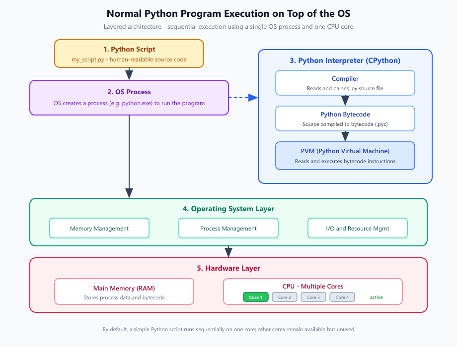
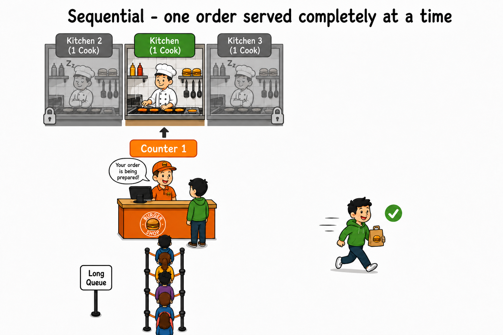
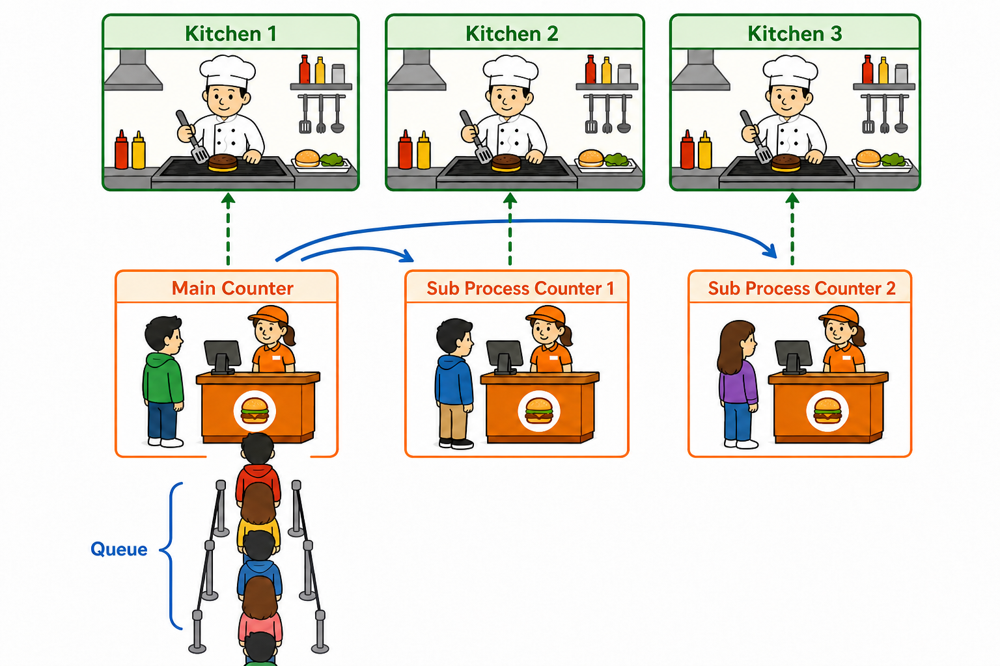
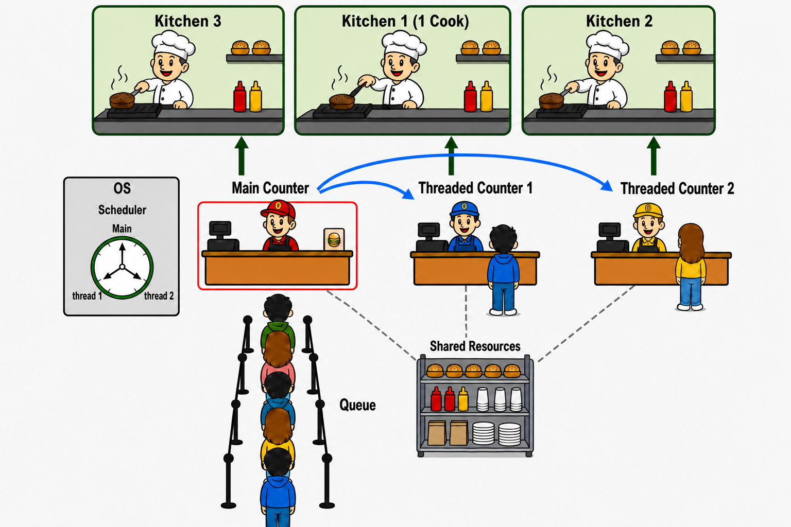

# Different Parallel Processing concepts in Python

<p align="center">
    
</p>

<p align="center"><strong>Fig:</strong> Sequential processing</p>

<br>

<p align="center">
    
</p>

<p align="center"><strong>Fig:</strong> Parallel processing</p>

The two images above show the basic difference between the **default sequential way** of running a program and the **parallel way**.

In sequential processing, tasks are done **one after another** by a single worker — like one counter serving 10 people in a single queue. In parallel processing, the same work is split across **multiple workers** that run at the same time — like 5 counters each serving people together. When the tasks do not depend on each other, parallel execution can finish the full job sooner.

Now, let's see this in depth.

# How Does Python Execute a Program?

<p align="center">
    
</p>

<p align="center"><strong>Fig:</strong> Normal Python program execution layered on top of the operating system</p>

To run a simple Python script, you use a command like this:

```bash
python my_script.py
```

### Here is what happens in simple terms:

- **`python`** — This is the Python program. Consider it as a builder function that connect different parts of python.
- **`my_script.py`** — This is your script file. It contains the Python code you wrote.
- When you run the command, `my_script.py` is passed to the `python` as a **command-line argument** along with other parameters.

### Internal steps that take place

When you run the command, these steps happen inside the system:

1. **OS creates a process**  
   The operating system starts a new process for the Python executable (for example, `python.exe`).

2. **Core environment is initialized**  
   - Memory is allocated  
   - Internal data structures are set up  
   - System paths are configured

3. **PVM starts**  
   The Python Virtual Machine (PVM) is ready to run your program.

4. **Source is compiled to bytecode**  
   - The interpreter reads and parses `my_script.py`  
   - The source code is compiled into **bytecode** (`.pyc`)

5. **PVM executes the bytecode**  
   The PVM runs a main evaluation loop. For each instruction, it:
   1. **Fetches** the next bytecode instruction  
   2. **Decodes** the instruction  
   3. **Executes** the instruction  

   This loop repeats until the program finishes.

<br>

<p align="center">
    
</p>

<p align="center"><strong>Fig:</strong> Python process PVM loop fetching and executing bytecode on a single CPU core</p>

# Types of Parallel Processing in Python

By default, Python runs your program on **one CPU core** (even if the system has multiple cores), in **one process**, with **one main thread**. To handle many tasks at the same time, Python gives you a few different options.

1. No parallel Processing (Sequential)
2. Async I/O (Asyncio)
3. Multithreading
4. Multiprocessing
5. Free threads

> [!NOTE]
> **Reader's guide:** Let's explain each option using a **burger shop** example. Here is what each part of the shop means:
>
> | Burger shop | In Python |
> |-------------|-----------|
> | **Kitchen** | A **CPU core in hardware level**. One kitchen = one core. The cook is the core doing the actual work. |
> | **Counter** | A **thread of execution in OS level** — where the PVM takes instructions and sends them for execution. |
> | **People in the queue** | The **tasks (bytecode instructions)** of your program, waiting to be executed. |

## No parallel Processing (Sequential)

<p align="center">
    
</p>

<p align="center"><strong>Fig:</strong> Sequential - one counter, one kitchen, one cook; each customer orders, waits at the counter until the food is ready, and leaves before the next person is served</p>

This is the normal way a Python program runs. The bytecode instructions wait in order, like a queue. The PVM picks one instruction, executes it on a single CPU core, then picks the next one — and so on until the program ends. This cycle is the **main evaluation loop** of the PVM.

The other cores of the CPU will remains unused.

## Async I/O (Coroutines)

<p align="center">
    
</p>

<p align="center"><strong>Fig:</strong> Async I/O - one counter; quick orders leave immediately, long-wait orders sit on the bench while the counter keeps serving. Less resource is required: one cook and one staff at counter</p>

`asyncio` is a Python module that supports **coroutines** — lightweight tasks that enable **concurrency** within a **single process and a single thread**, managed by an **event loop** (the `main evaluation loop`).

The idea is simple: the programmer marks time-consuming work (like network or file I/O) with `async/await`. Such a task is placed on the **waiting bench**, and the event loop moves on to other instructions instead of standing idle. The loop occasionally checks the bench (is the burger ready?), and when a task finishes, its result is collected.

This way the loop is **never blocked** by a slow task. Note that tasks still run one at a time — asyncio gives concurrency, not true parallelism — and it works only if the code is written cooperatively (using `async/await` correctly).

`Coroutines` are just a smarter arrangement inside the **event loop**. They need no extra resources compared to sequential execution. In our burger shop example, it is simply the counter staff managing their own counter more efficiently.

But the other cores of the CPU will remains unused.

## Multithreading

<p align="center">
    
</p>

<p align="center"><strong>Fig:</strong> Multithreading - three counters but shared kitchen and Counter staff. GIL clock picks one counter and the counter staff have to jump into that counter; only one shared kitchen cooks at a time</p>

In multithreading, the main thread can create extra **threads** (the extra 2 `threaded counters` in burger shop example). You might expect all these threads to run in parallel with the main thread — but in CPython, they do not. Because there is only one staff to run all the counters.

In our burger shop example, a clock (GIL managed by PVM) displays which counter the staff must work at. The staff works only at that counter. Periodically, the clock switches to the next counter, and the staff moves there.

The reason is a lock called the **Global Interpreter Lock (GIL)** is required in python. All threads in a python process (including the main thread) share this one lock, and **only the thread holding the GIL can execute Python bytecode** on a CPU core. The interpreter regularly releases the lock and handover it to another thread, so that threads take turns instead of running together.

The GIL exists to protect the interpreter's internal memory state — without it, multiple threads changing the same data at the same time could corrupt it. It also guarantees that a switch happens only **between** bytecode instructions, never in the middle of one bytecode instruction (one python bytecode instruction can have multiple machine level instructions).


## Multiprocessing

<p align="center">
    
</p>

<p align="center"><strong>Fig:</strong> Multiprocessing - All kitchens cook burgers at the same time</p>

In all the burger shop examples so far, the other two kitchens and cooks were never used. In other words, the processor had multiple cores, but the Python program used only one of them. For a **CPU-heavy program**, this is a waste — it would finish much faster if all cores worked at the same time. And as explained above, threads cannot achieve this: because of the **GIL**, a multithreaded Python program still uses only **one core at a time**.

**Multiprocessing** solves this problem. The main Python program creates multiple **child processes**, and the OS treats each one as a fully independent process. The OS schedules each process on its own CPU core, so the main process and all child processes run **in parallel, on different cores, at the same time**. In our burger shop example, each counter now has its own kitchen and cook — and all the kitchens cook independently at the same time.

You may wonder: the GIL exists to prevent data corruption in multithreading — so how does multiprocessing stay safe without a GIL? The answer is simple. Each process has its **own independent memory**. Variables are not shared between processes, unlike between threads. If two processes need to share data, you must do it explicitly using **inter-process communication (IPC)**. Since nothing is shared by default, there is no chance of data corruption.

## Free threads

<p align="center">
    
</p>

<p align="center"><strong>Fig:</strong> Free threading - no GIL clock; every counter has its own kitchen, and all kitchens cook at the same time</p>

**Free threading** is a recent concept in CPython (the official Python implementation). It was introduced as an experimental build in **Python 3.13** and became officially supported in **Python 3.14**. In simple terms, it is **multithreading without the GIL**. Threads no longer wait for one shared lock — they run truly in parallel, so Python can use **all CPU cores at the same time**.

In our burger shop example, there is no GIL clock anymore. The reception staff at the main counter redirects customers to the threaded counters, and every counter sends its orders to its **own kitchen**. All the kitchens cook **at the same time**. The **OS scheduler** decides which counter (thread) runs on which kitchen (core) — and now they can all work simultaneously.

How is this different from multiprocessing? No separate process is created for each thread. All threads live inside the **same process** and **share its memory and resources** — unlike processes, which each get their own.

As the image shows, in free threading all the counter staff **share the same resources**. In multiprocessing, by contrast, each staff member has their **own separate resources**.

Then how is the shared data kept safe without a GIL? Instead of one big lock, free-threaded CPython protects its internal data with many **fine-grained locks**. And for your own shared variables, your code must use **locks** (like `threading.Lock`) properly.

<br/>

# Comparison of All Methods

| | **Async I/O** | **Multithreading** | **Multiprocessing** | **Free threading** |
|---|---|---|---|---|
| **Python module** | `asyncio` | `threading` | `multiprocessing` | `threading` (no-GIL build) |
| **Processes** | 1 | 1 | Multiple | 1 |
| **Threads** | 1 | Multiple | 1 per process | Multiple |
| **CPU cores used** | 1 | 1 (GIL) | Multiple | Multiple |
| **True parallelism?** | No (concurrency only) | No (threads take turns) | Yes | Yes |
| **Memory** | Shared (same thread) | Shared between threads | Independent per process | Shared between threads |
| **Data safety** | Safe (single thread) | GIL + locks | Safe (nothing shared); IPC to share | Fine-grained locks + your own locks |
| **Best for** | Many waiting I/O tasks | I/O-bound tasks | CPU-heavy tasks | CPU-heavy and mixed tasks |
| **Burger shop** | One counter; long orders wait on the bench | Counters take turns by the GIL clock; one kitchen works | Each counter has its own kitchen and resources | All counters work at once and share resources |

