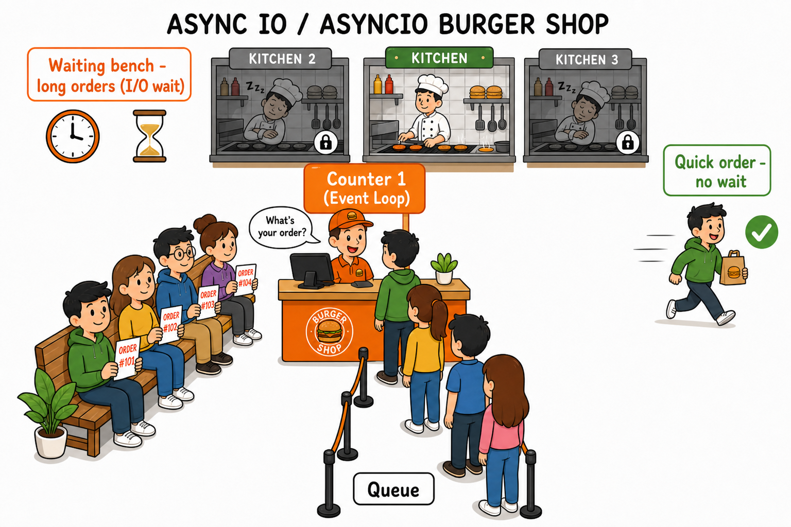
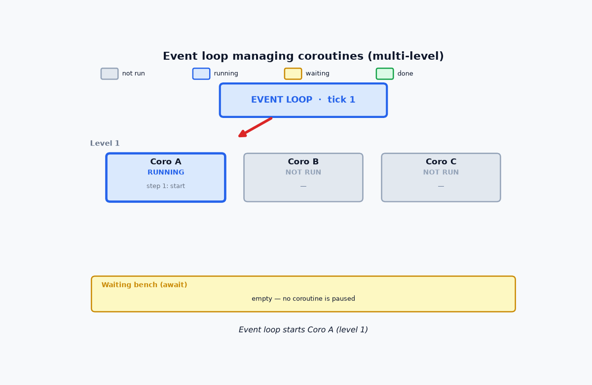
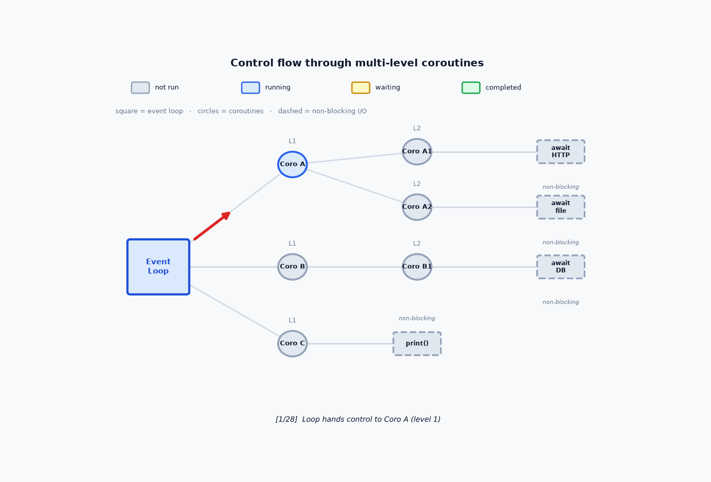
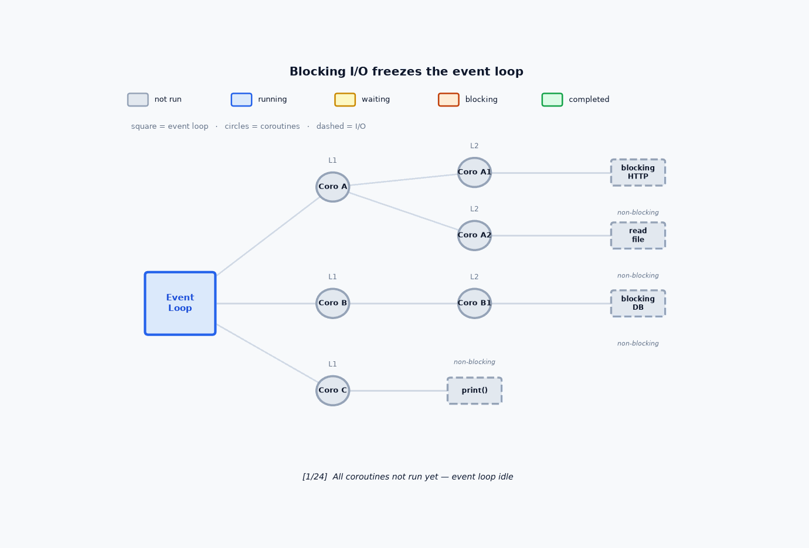

# Coroutines with asyncio

<p align="center">
    
</p>

<p align="center"><strong>Fig:</strong> Async I/O - one counter; quick orders leave immediately, long-wait orders sit on the bench while the counter keeps serving. Less resource is required: one cook and one staff at counter</p>

See the picture of the burger shop above. There is **one counter** — Counter 1 — with a single staff member taking orders. Customers stand in a **queue**, waiting their turn.

If orders are **quick**, the customer pays, and leaves right away — no waiting bench needed. But if orders are **long**, the staff gives the customer an order slip and sends them to the **waiting bench**. The counter immediately serves the next person in line.

**Coroutines** work the same way. Each customer is a task. When a task must wait for something slow — a network call, disk read, or database query — it sits on the **waiting bench**. In code, that pause is `await`. The **event loop** (the counter staff) does not stand still; it keeps serving the next customer in line and checks the bench from time to time: *Is order #101 ready yet?* When it is, that task picks up where it left off.

Notice the kitchens in the background: only **one kitchen is active**; the others are locked. Same here — asyncio uses only **one process, one thread and one CPU core**.

> | Burger shop | In Python |
> |-------------|-----------|
> | **Counter 1 (staff)** | The **event loop** — one thread that schedules work |
> | **Queue** | **Coroutines / tasks** waiting to run |
> | **Waiting bench (long orders)** | A coroutine **paused at `await`** while I/O completes |
> | **Quick order (no wait)** | A task that finishes immediately, without sitting on the bench |
> | **Kitchen (one active, others locked)** | **One CPU core** doing work at a time |

<br/>

In plain terms:

- A **normal function** (also called as **subroutine** in many languages) runs from start to finish — it does not stop in the middle.
- A **coroutine** can pause when it has to wait, let other tasks run, and then continue from where it left off.

## How coroutines are internally working in python ?

A **coroutine** is a function that can **pause in the middle** of its work and **resume later** from the same spot. In Python, this builds on the same idea as **generators** — both can stop partway through and continue again (generators use `yield`; async coroutines use `await`).

Python also runs an **event loop** — a loop that manages many coroutines together. It decides which coroutine runs next, which ones are waiting, and when a paused coroutine is ready to resume. In our burger shop example, the event loop is the **counter staff** keeping the queue and the waiting bench moving.

<p align="center">
    
</p>

<p align="center"><strong>Fig:</strong> Event-loop running example.</p>

### One another image to explain the eventloop and coroutine

<p align="center">
    
</p>

<p align="center"><strong>Fig:</strong> Another event-loop example with multi-level coroutines working</p>


### Below code explain how it is internally organized

> [!NOTE]
> This is just for illustrative purpose. Not the actual implementation

```python
def coroutine(name: str):
    print(f"{name}: step 1")
    yield  # pause — control returns to the event loop
    print(f"{name}: step 2")
    yield
    print(f"{name}: step 3")


def event_loop(*tasks):
    # Each task is a generator object (a coroutine under the hood)
    active = list(tasks)

    while active:
        for gen in active[:]:
            try:
                next(gen)  # run until the next yield
            except StopIteration:
                active.remove(gen)


event_loop(coroutine("A"), coroutine("B"), coroutine("C"))
```

**Output:**
```
A: step 1
B: step 1
C: step 1
A: step 2
B: step 2
C: step 2
A: step 3
B: step 3
C: step 3
```

Source: [`event_loop_demo.py`](../code/3100_asyncio_coroutines/event_loop_demo.py)

As shown in the above code, `coroutines` are generators. The **event_loop()** is just a loop that has access to the coroutines.

`event_loop()` loops through the added *`coroutines`*. In each cycle, it calls `next()` on each coroutine. `coroutines` run their statements until a **`yield`** is found. When a **`yield`** is found, the coroutine pauses and the loop moves on to the next `coroutine`.

When every `coroutine` has yielded once, the loop starts another round. This way A, B, and C are **working concurrently**. When a coroutine has no more code after its last **`yield`**, `next()` raises **`StopIteration`** and the loop removes that task.

Finally, after all `coroutines` are removed, the `event loop` exits and control moves to the next statements after `event_loop()`.

## Advantages of concurrency

The previous example showed many tasks taking turns in one loop. While one task **waits**, others can **move forward**. That is the main win.

### **Below shows some use cases of _coroutines_ or _async I/O_**

**1. Waiting for slow work (I/O) does not block everything**

Network calls, file reads, and database queries spend most of their time **waiting** — not using the CPU.

*Simple example:* Task A starts a web request and pauses at `await`. While the response travels over the network, the loop runs Task B and Task C. When the response arrives, Task A resumes. One thread handled all three without sitting idle during the wait.

**2. Many independent jobs can make progress together**

Sometimes your program has several things that should run cuncurrently — not one after another in a strict line.

*Simple example:* 
 - A game loop updates player input, enemy AI, and the scoreboard in the same frame.
  - A UI app refreshes the clock while also handling button clicks.

**3. Many tasks, one thread — less overhead than many processes**

Each new **process** costs extra memory and setup. Coroutines share one process and one thread, so you can run **many** waiting tasks without spawning a process per task.

*Simple example:* A server handling 1,000 open client connections with asyncio uses far less memory than 1,000 separate processes — because most connections are just waiting for data, and the event loop switches between them cheaply.

## The building blocks of concurrency

Python async concurrency rests on two pieces working together:

> | Component | What it does | Burger shop |
> |-----------|--------------|---------------|
> | **Coroutine** | A task that can **pause** and **resume** mid-work | A customer — may sit on the **waiting bench** while a long order cooks |
> | **Event loop** | Chooses which coroutine runs next, and when to wake a paused one | The **counter staff** — serves the queue and checks the bench |

**Coroutines** are the work itself — functions that stop at `await` (or `yield` in our generator demo) and pick up again later.

**The event loop** is the manager — it keeps active tasks in a queue, runs each until it pauses, then moves on to the next. When I/O is ready, it resumes the waiting coroutine.

## Non-blocking waiting - the core idea behind **Concurrency**

Concurrency in python only works as expected when slow tasks **do not block the `control flow` while it waits**. If you are using blocking calls inside coroutines, the coroutine will not give you any advantages.

### Blocking vs non-blocking I/O

| | Blocking call | Non-blocking call |
|---|---|---|
| **Example** | `requests.get(url)`, `socket.setblocking(True)` | `aiohttp`, `socket.setblocking(False)` |
| **While waiting** | Control sits inside the function | Call returns immediately; You have to `poll` or set a `callback` to get result |

> [!IMPORTANT]
> A single **blocking** call on the event-loop freezes **every** coroutine until that call finishes — nothing else can run in the meantime.

The animations below contrast **blocking** and **non-blocking** operations on the same event loop.

<p align="center">
    
</p>

<p align="center"><strong>Fig:</strong> Blocking flow — the event loop freezes until each call returns.</p>

<p align="center">
    
</p>

<p align="center"><strong>Fig:</strong> Non-blocking flow — the loop switches tasks while I/O waits.</p>

As the animation above shows, a **blocking** call stops the event loop’s **control flow**. Even if your code is written as coroutines, one blocking call on the loop holds **everything** — no other coroutine can run until that call finishes.

That is why the non-blocking calls are very important in coroutines.

### What is a `non-blocking` call ?

**Let me explain this with an example — posting data to a server**

Suppose you call **`requests.post()`** to send data to a server. That single call does not finish quickly. It waits while:

- your data travels to the server
- the server processes it
- the response travels back to you

Your program **cannot move on** until all of that is done. The program controll sits inside `requests.post()` the whole time. That is a **blocking** call.

A **non-blocking** (async) approach works differently. You **start** the request, then **return control to the event loop** right away (via `await` or `yield`). While the work happens in lower layer of the network or in server, the loop can run **other coroutines**. When the response is ready, the loop **resumes** the previous task.

Non-blocking I/O needs **async-friendly libraries**. The popular `requests` library is **blocking only**. So are calls like `time.sleep()`. For asyncio, use alternatives such as **`aiohttp`**, **`httpx`** (async mode), or **`asyncio.sleep()`**.

> [!NOTE]
> I created my own *sample coroutines, event loop, and a* **non-blocking HTTP library** [`nonblocking_http.py`](../code/3100_asyncio_coroutines/nonblocking_http.py) and [`nonblock/http.py`](../code/3100_asyncio_coroutines/nonblock/http.py). This code will help you understand how coroutines are implemented in Python and explain how non-blocking is implemented and managed. *Please go through it if you are interested.*


### Why can't we use `threads or processes` to achieve **non-blocking calls?**

Threads and processes can be used to create non-blocking calls. But each thread or process costs extra memory and setup. On the other hand, asyncio event loops can manage **many** cuncurrent tasks on **a single main loop**, which is lighter.

### What kinds of tasks can be improved by coroutines?

Some type of tasks take a long time to finish. Here are common examples:

1. Sending or receiving data over the **network**
2. Running **database** queries
3. **Reading or writing** files on disk
4. **Video or audio** processing
5. **Heavy data** processing

Items 1–3 are **I/O-bound** — the program spends most of its time **waiting** on i/o devices (network, disk, or database).

Items 4–5 are **CPU-bound** — the **CPU** does the heavy work.

Non-blocking coroutines help to improve the performance of **I/O-bounded** tasks, where waiting is the bottleneck. Because when the task is waiting in network, the CPU is free to do useful work elsewhere. Then event-loops can switch the control to the other coroutines.

**CPU-bounded** tasks are different: they keep the CPU busy the whole time. The CPU has no free time to hand over the control to other work. Pausing and switching coroutines does not help here.

> **Why?** Asyncio runs on **one process, one thread and one CPU core** at a time. Switching coroutines only benificial when **CPU core having free time** — for example, while it is waiting on the network. In CPU-bound work, the core stays busy calculating. Switching to another coroutine does not run two calculations at same time (because only one **CPU core** is available); it just **takes turns**, and the total CPU work stays the same. You may even add **extra overhead** from pausing and resuming. To finish CPU-heavy jobs faster, run them in **parallel** across multiple cores — Go through my parallel processing tutorial for more details [Parallel Processing](./3000_parallel_processing.md).


## Unfold `coroutine` syntax

I am going to implement my own `coroutines` below. It is connecting to and fetching data from:

1. **http server**: `process_server_data()` coroutine
2. **databse server**: `process_db_data()` coroutine

For simplicity, I am not connecting to any realtime server. I am just mocking non-blocked server connection using a non-blocking `mock_server_connect()`.


```python
import random
import time

from collections.abc import Generator


def nonblocking_sleep(
    seconds: float,
) -> Generator[None, None, None]:
    """Nonblocking sleep for a random number of seconds"""
    
    deadline = time.monotonic() + seconds
    while time.monotonic() < deadline:
        yield None
    return None


def mock_server_connect(
    server_name: str,
) -> Generator[None, None, str]:
    """Mock server connection"""

    # START: mocked server connection
    # by non-blocking sleep for a random seconds
    mock_delay = random.randint(5, 20)
    sleep_gen = nonblocking_sleep(mock_delay)
    while True:
        try:
            next(sleep_gen)
            yield None
        except StopIteration:
            break
    # DONE: mocked server connection

    return f"RESULT:{server_name}"


def process_server_data(
    server_name: str,
) -> Generator[None, None, str]:
    print(f"{time.strftime('%H:%M:%S')} STARTED: {server_name} >")

    connect_gen = mock_server_connect(server_name)
    while True:
        try:
            next(connect_gen)
            yield None
        except StopIteration as stopped:
            data = stopped.value
            break

    print(f"{time.strftime('%H:%M:%S')} COMPLETED: {server_name} <")
    return data


def process_db_data(
    server_name: str,
) -> Generator[None, None, str]:
    print(f"{time.strftime('%H:%M:%S')} STARTED: {server_name} >")

    connect_gen = mock_server_connect(server_name)
    while True:
        try:
            next(connect_gen)
            yield None
        except StopIteration as stopped:
            data = stopped.value
            break

    print(f"{time.strftime('%H:%M:%S')} COMPLETED: {server_name} <")
    return data


class EventLoop:
    def __init__(self):
        self.tasks = []
        self.results = []

    def add_task(self, task):
        self.tasks.append(task)

    def run(self):
        while self.tasks:
            try:
                task = self.tasks.pop(0)
                next(task)
                self.tasks.append(task)
            except StopIteration as stopped:
                self.results.append(stopped.value)


if __name__ == "__main__":
    event_loop = EventLoop()

    event_loop.add_task(process_server_data("SERVER-A"))
    event_loop.add_task(process_server_data("SERVER-B"))
    event_loop.add_task(process_server_data("SERVER-C"))
    event_loop.add_task(process_db_data("DB-A"))
    event_loop.add_task(process_db_data("DB-B"))
    event_loop.add_task(process_db_data("DB-C"))

    print()
    print("Running event loop: >>>>>>>>>>>>>>>>")
    print()
    event_loop.run()
    print()
    print("Event loop completed: <<<<<<<<<<<<<<<")
    print("Results:", event_loop.results)
    print()
```

**Output:**
```
Running event loop: >>>>>>>>>>>>>>>>

07:51:17 STARTED: SERVER-A >
07:51:17 STARTED: SERVER-B >
07:51:17 STARTED: SERVER-C >
07:51:17 STARTED: DB-A >
07:51:17 STARTED: DB-B >
07:51:17 STARTED: DB-C >
07:51:23 COMPLETED: SERVER-B <
07:51:25 COMPLETED: DB-C <
07:51:27 COMPLETED: DB-B <
07:51:31 COMPLETED: SERVER-C <
07:51:31 COMPLETED: DB-A <
07:51:34 COMPLETED: SERVER-A <

Event loop completed: <<<<<<<<<<<<<<<
Results: ['RESULT:SERVER-B', 'RESULT:DB-C', 'RESULT:DB-B', 'RESULT:SERVER-C', 'RESULT:DB-A', 'RESULT:SERVER-A']
```

Source: [`coroutine_syntax_demo.py`](../code/3100_asyncio_coroutines/coroutine_syntax_demo.py)


From this above code, you can see some code pattern is repeating as given below:

```python
connect_gen = mock_server_connect(server_name)
while True:
    try:
        next(connect_gen)
        yield None
    except StopIteration as stopped:
        data = stopped.value
        break
```

This whole section can be improved using below generic code:

```python
data = yield from mock_server_connect(server_name)
```


Thus, we can reduce the the repeating code and make more readable code as below that gives the same result:

```python
import random
import time

from collections.abc import Generator


def nonblocking_sleep(
    seconds: float,
) -> Generator[None, None, None]:
    """Nonblocking sleep for a random number of seconds"""
    deadline = time.monotonic() + seconds
    while time.monotonic() < deadline:
        yield None
    return None


def mock_server_connect(
    server_name: str,
) -> Generator[None, None, str]:
    """Mock server connection"""

    # START: mocked server connection
    # by non-blocking sleep for a random seconds
    mock_delay = random.randint(5, 20)
    yield from nonblocking_sleep(mock_delay)
    # DONE: mocked server connection

    return f"RESULT:{server_name}"


def process_server_data(
    server_name: str,
) -> Generator[None, None, str]:
    print(f"{time.strftime('%H:%M:%S')} STARTED: {server_name} >")

    data = yield from mock_server_connect(server_name)

    print(f"{time.strftime('%H:%M:%S')} COMPLETED: {server_name} <")
    return data


def process_db_data(
    server_name: str,
) -> Generator[None, None, str]:
    print(f"{time.strftime('%H:%M:%S')} STARTED: {server_name} >")

    data = yield from mock_server_connect(server_name)

    print(f"{time.strftime('%H:%M:%S')} COMPLETED: {server_name} <")
    return data


class EventLoop:
    def __init__(self):
        self.tasks = []
        self.results = []

    def add_task(self, task):
        self.tasks.append(task)

    def run(self):
        while self.tasks:
            try:
                task = self.tasks.pop(0)
                next(task)
                self.tasks.append(task)
            except StopIteration as stopped:
                self.results.append(stopped.value)


if __name__ == "__main__":
    event_loop = EventLoop()

    event_loop.add_task(process_server_data("SERVER-A"))
    event_loop.add_task(process_server_data("SERVER-B"))
    event_loop.add_task(process_server_data("SERVER-C"))
    event_loop.add_task(process_db_data("DB-A"))
    event_loop.add_task(process_db_data("DB-B"))
    event_loop.add_task(process_db_data("DB-C"))

    print()
    print("Running event loop: >>>>>>>>>>>>>>>>")
    print()
    event_loop.run()
    print()
    print("Event loop completed: <<<<<<<<<<<<<<<")
    print("Results:", event_loop.results)
    print()
```

**Output:**
```
Running event loop: >>>>>>>>>>>>>>>>

07:56:32 STARTED: SERVER-A >
07:56:32 STARTED: SERVER-B >
07:56:32 STARTED: SERVER-C >
07:56:32 STARTED: DB-A >
07:56:32 STARTED: DB-B >
07:56:32 STARTED: DB-C >
07:56:38 COMPLETED: SERVER-B <
07:56:40 COMPLETED: SERVER-C <
07:56:46 COMPLETED: DB-A <
07:56:46 COMPLETED: DB-C <
07:56:49 COMPLETED: DB-B <
07:56:50 COMPLETED: SERVER-A <

Event loop completed: <<<<<<<<<<<<<<<
Results: ['RESULT:SERVER-B', 'RESULT:SERVER-C', 'RESULT:DB-A', 'RESULT:DB-C', 'RESULT:DB-B', 'RESULT:SERVER-A']
```

Source: [`coroutine_yield_from_demo.py`](../code/3100_asyncio_coroutines/coroutine_yield_from_demo.py)


**Python asyncio coroutines are nothing but same concept.** Its a syntax support using some predefined and dedicated keywords. Also it is giving some high level module support.

Here is what we have to do:

1. prefix **async** keyword before **def** - so that compiler can identify that it is a coroutine.
2. use **await** instead of **yield from *generator_ins***.
3. Use `asyncio`'s builtin **event loop** object.
4. Use `asyncio`'s builtin **non-blocked** `asyncio.sleep()` or other coroutines

In short, asyncio gives you the same building blocks we built by hand — coroutine functions, a way to pause without blocking, an event loop to schedule work, and ready-made non-blocking helpers — but with cleaner syntax and less boilerplate.

Thus, you can create the same functionality using asyncio module as given below:

```python
import asyncio
import random
import time


async def mock_server_connect(server_name: str) -> str:
    """Mock server connection"""

    # START: mocked server connection
    # by non-blocking sleep for a random number of seconds
    mock_delay = random.randint(5, 20)
    await asyncio.sleep(mock_delay)
    # DONE: mocked server connection

    return f"RESULT:{server_name}"


async def process_server_data(server_name: str) -> str:
    print(f"{time.strftime('%H:%M:%S')} STARTED: {server_name} >")

    data = await mock_server_connect(server_name)

    print(f"{time.strftime('%H:%M:%S')} COMPLETED: {server_name} <")
    return data


async def process_db_data(server_name: str) -> str:
    print(f"{time.strftime('%H:%M:%S')} STARTED: {server_name} >")

    data = await mock_server_connect(server_name)

    print(f"{time.strftime('%H:%M:%S')} COMPLETED: {server_name} <")
    return data


async def main() -> None:
    print()
    print("Running event loop: >>>>>>>>>>>>>>>>")
    print()

    loop = asyncio.get_running_loop()
    scheduled = [
        loop.create_task(process_server_data("SERVER-A")),
        loop.create_task(process_server_data("SERVER-B")),
        loop.create_task(process_server_data("SERVER-C")),
        loop.create_task(process_db_data("DB-A")),
        loop.create_task(process_db_data("DB-B")),
        loop.create_task(process_db_data("DB-C")),
    ]
    results = list(await asyncio.gather(*scheduled))

    print()
    print("Event loop completed: <<<<<<<<<<<<<<<")
    print("Results:", results)
    print()


if __name__ == "__main__":
    loop = asyncio.new_event_loop()
    asyncio.set_event_loop(loop)
    try:
        loop.run_until_complete(main())
    finally:
        loop.close()
```

**Output:**
```
Running event loop: >>>>>>>>>>>>>>>>

09:19:17 STARTED: SERVER-A >
09:19:17 STARTED: SERVER-B >
09:19:17 STARTED: SERVER-C >
09:19:17 STARTED: DB-A >
09:19:17 STARTED: DB-B >
09:19:17 STARTED: DB-C >
09:19:27 COMPLETED: DB-A <
09:19:28 COMPLETED: SERVER-A <
09:19:28 COMPLETED: DB-B <
09:19:30 COMPLETED: SERVER-B <
09:19:30 COMPLETED: SERVER-C <
09:19:30 COMPLETED: DB-C <

Event loop completed: <<<<<<<<<<<<<<<
Results: ['RESULT:SERVER-A', 'RESULT:SERVER-B', 'RESULT:SERVER-C', 'RESULT:DB-A', 'RESULT:DB-B', 'RESULT:DB-C']
```

Source: [`asyncio_coroutine_demo.py`](../code/3100_asyncio_coroutines/asyncio_coroutine_demo.py)


Again if you want, you can use some high level functions of `asynio` and improve it as given below:

```python
import asyncio
import random
import time


async def mock_server_connect(server_name: str) -> str:
    """Mock server connection"""
    mock_delay = random.randint(5, 20)
    await asyncio.sleep(mock_delay)
    return f"RESULT:{server_name}"


async def process_data(server_name: str) -> str:
    print(f"{time.strftime('%H:%M:%S')} STARTED: {server_name} >")
    data = await mock_server_connect(server_name)
    print(f"{time.strftime('%H:%M:%S')} COMPLETED: {server_name} <")
    return data


async def main() -> None:
    print()
    print("Running event loop: >>>>>>>>>>>>>>>>")
    print()

    task_names = [
        "SERVER-A",
        "SERVER-B",
        "SERVER-C",
        "DB-A",
        "DB-B",
        "DB-C",
    ]
    results = list(await asyncio.gather(*(process_data(name) for name in task_names)))

    print()
    print("Event loop completed: <<<<<<<<<<<<<<<")
    print("Results:", results)
    print()


if __name__ == "__main__":
    asyncio.run(main())
```

**Output:**
```
Running event loop: >>>>>>>>>>>>>>>>

09:24:05 STARTED: SERVER-A >
09:24:05 STARTED: SERVER-B >
09:24:05 STARTED: SERVER-C >
09:24:05 STARTED: DB-A >
09:24:05 STARTED: DB-B >
09:24:05 STARTED: DB-C >
09:24:11 COMPLETED: SERVER-C <
09:24:13 COMPLETED: DB-C <
09:24:14 COMPLETED: DB-A <
09:24:16 COMPLETED: SERVER-A <
09:24:16 COMPLETED: SERVER-B <
09:24:17 COMPLETED: DB-B <

Event loop completed: <<<<<<<<<<<<<<<
Results: ['RESULT:SERVER-A', 'RESULT:SERVER-B', 'RESULT:SERVER-C', 'RESULT:DB-A', 'RESULT:DB-B', 'RESULT:DB-C']
```

Source: [`asyncio_coroutine_simple_demo.py`](../code/3100_asyncio_coroutines/asyncio_coroutine_simple_demo.py)


### Generator coroutines vs asyncio

The examples above solve the same problem in two ways. The table below maps each building block from our DIY generator coroutines to its asyncio equivalent:

| Concept | DIY coroutine (generator) | asyncio |
| --- | --- | --- |
| Mark a function as a coroutine | `def` with `yield` / `yield from` | `async def` |
| Pause and delegate to another coroutine | `yield from generator` | `await coroutine` |
| Run and schedule tasks | Custom `EventLoop` with `next()` / `add_task()` | `asyncio.run()` or `loop.run_until_complete()` with `asyncio.gather()` |
| Non-blocking wait | `nonblocking_sleep()` — `yield None` in a loop | `await asyncio.sleep(seconds)` |

