# Class Diagrams

## On this page

- [Classes](#classes)
- [Inheritance](#inheritance)
- [Attribute or method access](#attribute-or-method-access)
- [Relationships](#relationships)
- [Realization](#realization)
- [Inheritance](#inheritance-1)
- [Dependency (dashed arrow, one-directional)](#dependency-dashed-arrow-one-directional)
- [Dependency (dashed line, multi direction)](#dependency-dashed-line-multi-direction)
- [Association (One directional)](#association-one-directional)
- [Association (no arrow)](#association-no-arrow)
- [Indirect Associations](#indirect-associations)
- [Aggregation](#aggregation)
- [Composition](#composition)

## Classes


~~~
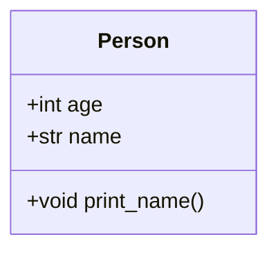
~~~


## Inheritance

Inheritance are not actually the part of classdiagrams therotically. They will be included in sequence diagram or flowchart.
But practically if you want to include it some where in class diagrams, show it as given below.


~~~
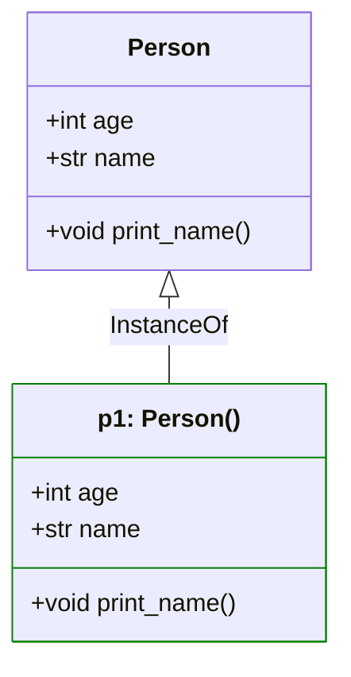
~~~


## Attribute or method access
- `+` → public  
- `-` → private  
- `#` → protected 


## Relationships

| Syntax                | Relationship | Simple explanation                                                                     |
| --------------------- | ------------ | -------------------------------------------------------------------------------------- |
| `classM <\|.. classN` | Realization  | A class implements `interface` or `ABC Method` that are defined in its base class.     |
| `classA <\|-- classB` | Inheritance  | A child class extends a parent class and inherits its behavior.                        |
| `classK <.. classL`   | Dependency [with direction]   | One class **uses** another class **temporarily**, such as for a method parameter or local variable. |
| `classO .. classP`    | Dependency   | Both classes may uses together temporarily. Or we can't specify a direction.           |
| `classG <-- classH`   | Association [with direction]  | One class **has a** relationship with another class. The relationship will be **permenent**. |
| `classI -- classJ`    | Association  | Both classes are linked **permenantly**, or it is unclear to specify the direction.    |
| `classE o-- classF`   | Aggregation  | The whole **contains** parts, but the parts can still exist on their own.              |
| `classC *-- classD`   | Composition  | The whole **owns** its parts. If the whole is destroyed, the parts are destroyed too.  |


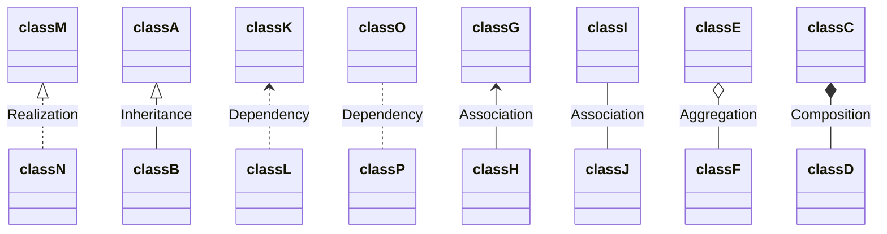


## Realization

A class **implements** an interface or abstract contract. The dashed arrow points from the implementing class to the interface.

**Example:** A `Report` class implements a `Printable` interface. Any class that implements `Printable` must provide a `print_doc()` method.

```python
from abc import ABC, abstractmethod


class Printable(ABC):
    @abstractmethod
    def print_doc(self) -> None:
        pass


class Report(Printable):
    def print_doc(self) -> None:
        print("Printing report")
```

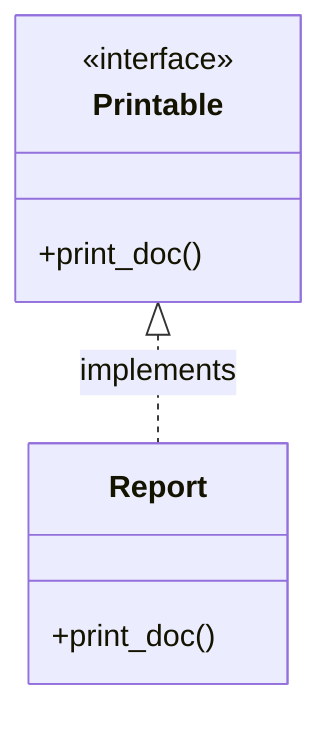

## Inheritance

A **child class** extends a **parent class** and inherits its attributes and methods.

**Example:** `Dog` is a type of `Animal`. `Dog` gets `speak()` from `Animal` and can override it.

```python
class Animal:
    def speak(self) -> str:
        return "..."


class Dog(Animal):
    def speak(self) -> str:
        return "woof"
```

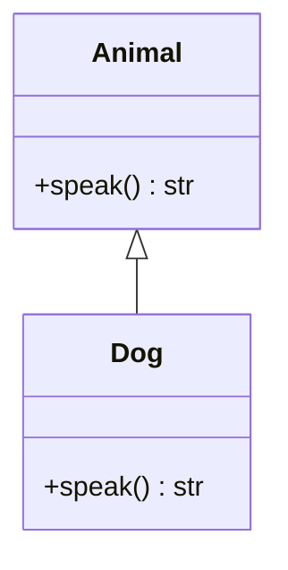


## Dependency (dashed arrow, one-directional)

One class **depends on** or **uses** another for a short time, is called a **dependency relation**.

**Example:** `Logger` uses and depends on `User` when `log_user()` method is called.

```python
class User:
    def __init__(self, user_data: dict) -> None:
        self.name = user_data["name"]
        self.age = user_data["age"]
        self.address = user_data["address"]

        self.id = get_id(self.name)


class Logger:
    def __init__(self, config: dict) -> None:
        self.config = config
    
    def log(self, log_data: str) -> None:
        print(log_data)

    def log_user(self, user: User) -> None:
        self.log(f"LOG: { user.id } -> {user.name}")
```

Please note that `user` is just an argument of `Logger.log_user()` method and that **argument is not saved** (as a data member) for future use, long-term use, or permanent use.

`Logger` depends on `User` because a change (like `User.name` being modified to `User.full_name`) will break `Logger.log_user()`. But here, `User` is fully independent from `Logger` (at least in this implementation). So we can consider this as **one-directional dependency.**

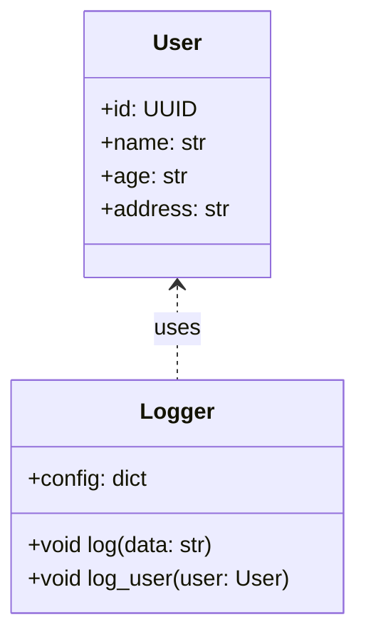

## Dependency (dashed line, multi direction)

If there have a **dependancy** from `A` to `B` and there have a dependance from `B` to `A`, it is called **bi-directional or multi-directional dependancy**.

It is possible to arranges classes like this. But it is considered as **Circular dependancy**. It is considered as a **bad design** and organization of classes. So, its better to avoid this type of implementation.

> In languages like Python, mutual dependencies between classes often become circular imports between modules. Those imports can fail at import time with an `ImportError`. Bidirectional dependency is valid in UML, but in code it usually signals tight coupling and is best avoided.


```python
class Document:
    def __init__(self, fpath: str) -> None:
        self.fpath = fpath
        self.data: list[str] = []

    def load_data_for_printer(self, printer: "TextPrinter") -> None:
        with open(self.fpath, encoding="utf-8") as file:
            for each_line in file:
                line = printer.format_line(each_line.rstrip("\n"))
                if line is not None:
                    self.data.append(data)


class TextPrinter:
    def __init__(self, skip: str = "#") -> None:
        self.skip = "#"

    def format_line(self, line: str) -> str | None:
        if line.startswith(self.skip):
            return None
        return line

    def print(self, document: Document) -> None:
        for each in document.data:
            print(each)


doc = Document("./mydocs/test.txt")
p1 = TextPrinter(skip="#")

doc.load_data_for_printer(p1)
p1.print(doc)
```


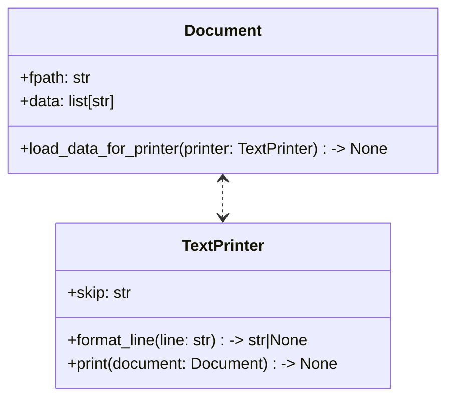

**Simple rule:** Use `<..` or `..>` when one class temporarily uses another and direction matters — point the arrow at the class being used. Use `..` when the classes are linked but direction is unclear or not important. Use `<..>` when both classes temporarily use each other (mutual dependency).


## Association (One directional)

This relation can be considered as the most basic relationship between two classes.
One class **has a relationship** with another class. That is called **Association**.

The relationship is called **Assosiation** if:
1. Two classes have a relationship
2. The rlationship can be atleast in one-direction or can be in two-directional

**Examples:** 

There are many examples of **associations**. For example, a `Customer` can have a `ShippingAddress`, and the customer's shipment can be sent to that address.

```python
class ShippingAddress:
    def __init__(self, street: str, city: str, zip_code: str):
        self._street = street
        self._city = city
        self._zip_code = zip_code

    def get_adr(self) -> str:
        return f"{self._street}, {self._city} - {self._zip_code}"


class Customer:
    def __init__(self, name: str):
        self._name = name
        self._addresses: list[ShippingAddress] = []

    def add_address(self, address: ShippingAddress) -> None:
        self._addresses.append(address)

    def ship_to_primary(self) -> str:
        if not self._addresses:
            return f"No address on file for {self._name}."

        adr = self._addresses[0].get_adr()
        return f"Shipping order for {self._name} to: {adr}"


if __name__ == "__main__":
    home_address = ShippingAddress(
        "123 Tech Lane",
        "Bengaluru",
        "560001"
    )

    customer = Customer("Alice")
    customer.add_address(home_address)

    print(customer.ship_to_primary())
```

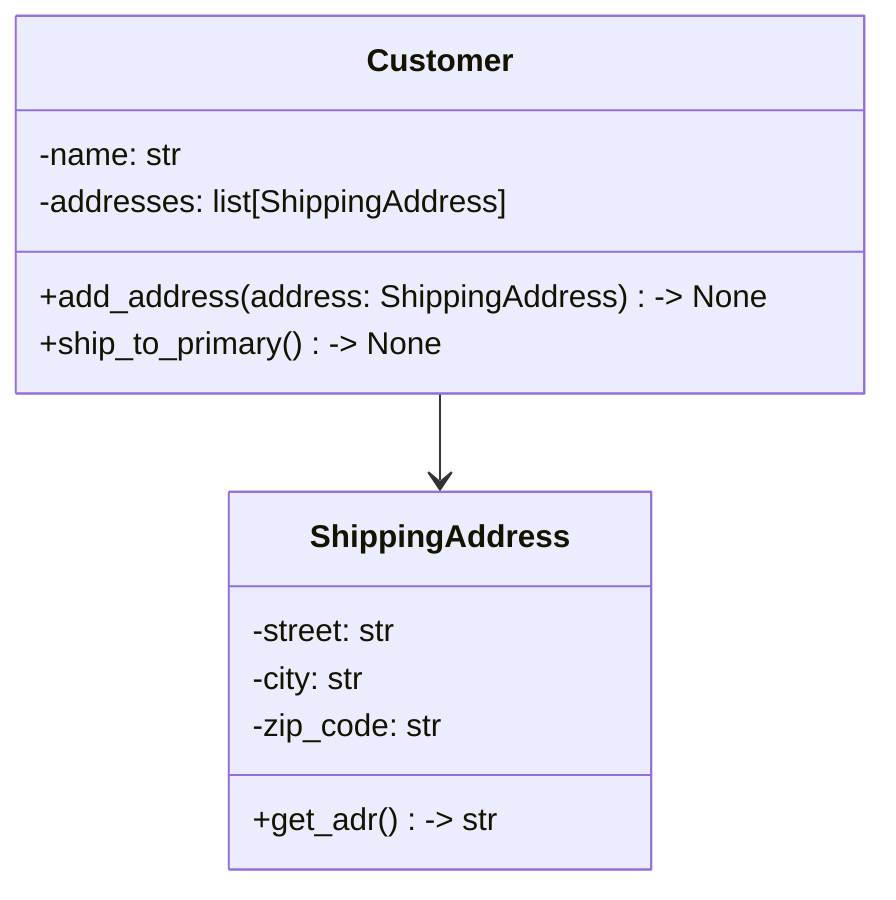

<br/>
> [!TIP]
> <b><u>Why is this association, not aggregation? </u></b><br/>
> Customer is not physically or conceptually <u>"made up of"</u> ShippingAddress. The ShippingAddress is merely an attribute associated with a Customer. As per the strict UML specification the container class must logically represent a physical or organizational whole, and the target class must represent a structural "part" of that whole. See, below sections for aggregation examples.


## Association (no arrow)
In UML, a plain solid line between two classes is a **bidirectional association**. Both class can be linked from the other. Use it when each classifier knows the other (for example, `Doctor` and `Patient`), or when you do not want to show navigation in only one direction.


```python
class Patient:
    def __init__(self, name: str):
        self._name = name
        self._doctor: "Doctor" | None = None

    @property
    def name(self) -> str:
        return self._name

    @property
    def doctor(self) -> "Doctor" | None:
        return self._doctor

    def set_doctor(self, doctor: "Doctor" | None) -> None:
        self._doctor = doctor


class Doctor:
    def __init__(self, name: str):
        self._name = name
        self._patients: list[Patient] = []

    @property
    def name(self) -> str:
        return self._name

    @property
    def patients(self) -> list[Patient]:
        return self._patients

    def admit_patient(self, patient: Patient) -> None:
        if patient not in self._patients:
            self._patients.append(patient)
            patient.set_doctor(self)


doc = Doctor("Dr. Smith")
pat = Patient("Bob")

doc.admit_patient(pat)

print(f"{doc.name}'s first patient is {doc.patients[0].name}.")

print(f"{pat.name}'s assigned physician is {pat.doctor.name}.")
```

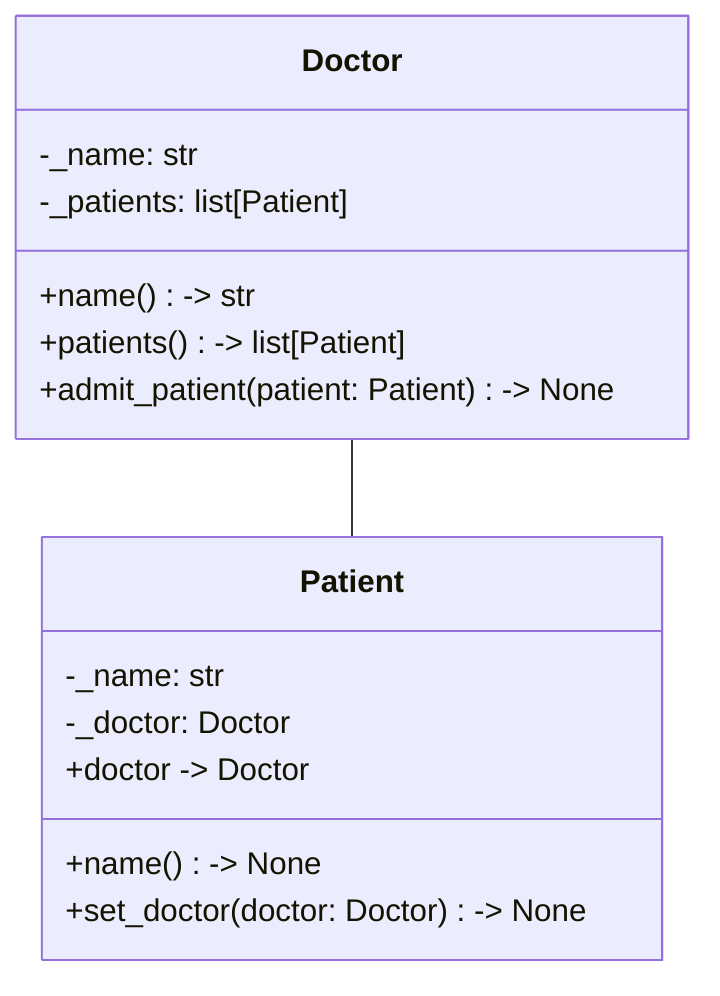

**Simple rule:** Use `-->` when only one side uses the other. Use `--` when the relationship goes both ways or direction is not meaningful.


## Indirect Associations

Some associations are **indirect**: two classes are related only through a third class, not by a direct link between them. The example below shows this pattern.

```python
class Course:
    def __init__(self, title: str) -> None:
        self.title = title
        self.teachers: list[Teacher] = []
        self.students: list[Student] = []


class Teacher:
    def __init__(self, name: str) -> None:
        self.name = name


class Student:
    def __init__(self, name: str) -> None:
        self.name = name
```

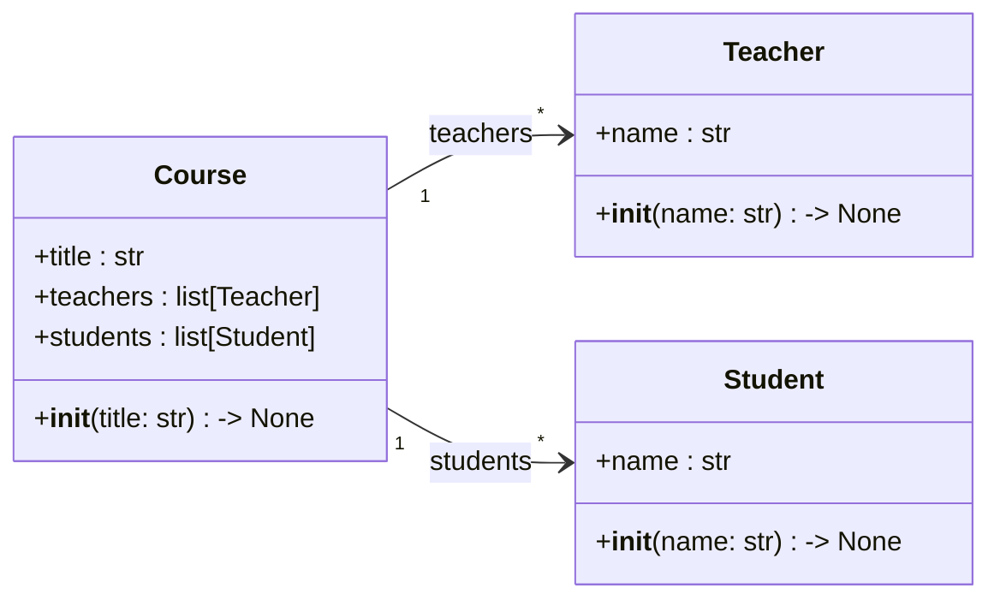

> [!NOTE]
> `Teacher` and `Student` may seem related, but in this model they are linked only **through** `Course`. That is an **indirect** relationship, not a direct UML **association** between `Teacher` and `Student`.
>
> Do **not** draw `Teacher --> Student`, `Student --> Teacher`, or `Teacher <--> Student`. Neither class references the other in the code.


## Aggregation

It is the concept of **whole** and **parts**.
The **whole** is a container type class that built by **parts**.
A **whole** contains **parts**, but the parts can still exist on their own.

**Example:** 

1. A `Library` contains `Books` objects
    - `Library` is **whole**
    - `Books` are **parts**
    - `Library` is a container of `Books`
        - This is the difference b/w **Assosiation**
2. Aggregations are strictly one directional
    - `Library` constructed by a groups of `Books`
    - But `Books` are independent from `Library`
3. `Library` can contain other attributes. But those are not considered aggregation
    - For example, `Library` may contain another attribute like `Staff`
    - But that attribute relation is an **Association** (not aggregation)
    - Because logically/physically a collection of `Staff` is not a library
    - But a collection of `Books` is a library
4. **You can delete `Library` instances without affecting added `Books`**
    - This is the difference b/w **Composition**


```python
class Employee:
    def __init__(self, name: str) -> None:
        self.name = name


class Department:
    def __init__(self, name: str) -> None:
        self.name = name
        self.staff: list[Employee] = []

    def add_employee(self, employee: Employee) -> None:
        self.staff.append(employee)


e1 = Employee("Arun")
e2 = Employee("Jose")

d = Department("IT")
d.add_employee(e1)
d.add_employee(e2)

print(e1.name)
print(e2.name)
del d
print(e1.name)  # e1 -> still lives
print(e2.name)  # e2 -> still lives
```

Here,
1. `Department` contains a list of `Employee`, and that is physically and logically correct
2. There can be multiple other attributes inside `Department`, but a collection of those attributes cannot physically or logically form a `Department`
    - For example, `Department` can have another attribute called `addresses`, which is also a list of instances of another class `Address` and is a permanent data member. But it cannot be considered an **Aggregation**
    - Because a group of `Address` instances cannot logically or physically form a `Department`. It is just an **Association** relation from `Department` to `Address`.
3. Even though a `Department` instance is removed, the `Employee` instances will not be deleted

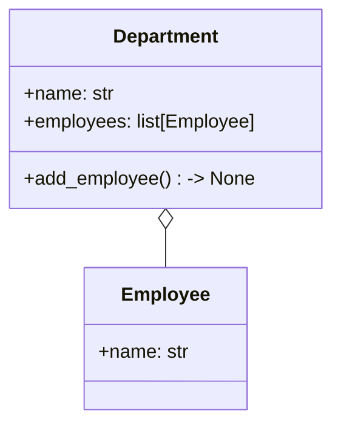


## Composition

A **whole** owns its **parts**. If the whole is destroyed, the parts are destroyed too.

1. A `Car` owns `Engine` object
    - `Car` is **whole**
    - `Engine` is **parts**
    - `Car` owns `Engine` as a part of `Car`
        - The diff b/w **Assosiation**
    - `Car` don't need to contain multiple **parts**
        - only one **part** (ie, `Engine`) is sufficient
    - `Car` made by including 1 or more parts like `Engine`
        - The diff b/w **Assosiation**
    - **if you delete `Car` instance, `Engine` also deleted**
        - The diff b/w **Aggregation**


```python
class Engine:
    def start(self) -> str:
        return "Engine started"


class Car:
    def __init__(self) -> None:
        self.engine = Engine()

    def start(self) -> str:
        return self.engine.start()

c1 = Car()
print(c1.engine)

del c1
# Now c1.engine also deleted automatically
```

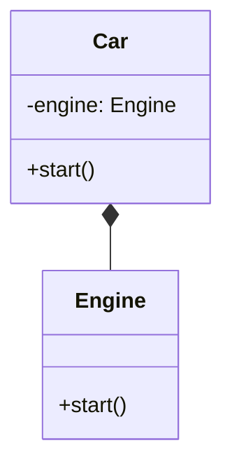

<p align="right">
    <a href="../../README.md">Home</a>
    &nbsp;|&nbsp;
    <a href="../README.md">Back to UML Index</a>
</p>
